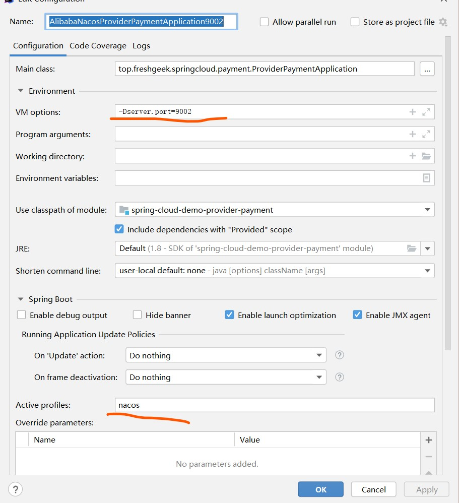

# SpringCloud 示例工程

## 前提约定
使用`-Dserver.port=` 添加虚拟机端口方式和指定配置环境方式替代多个复制多个模块方式

如图：



## 版本说明:H 版本 之后有停更

- 服务注册中心 -> Eureka (停更,不推荐用了)
  - Zookeeper
  - Consul
  - Nacos 重点

- 服务负载均衡 -> Ribbon (停更,但是还可以凑合用)
  - LoadBalancer

- 服务调用2 -> Feign 
  - OpenFeign

- 服务降级,熔断 -> Hystrix(部分老项目还在用)
  - resilience4j (国外推荐)
  - sentienl (推荐)

- 服务网关 -> Zuul
  - Zuul2(估计是出不来了,内部原因)
  - gateway
- 服务配置 -> Config
  - Nacos(阿里的,推荐)
  - 携程的apollo
- 服务总线 -> Bus
  - Nacos (阿里的推荐)
  
  
## eureka 服务

> 与zk+dubbo 类似


## openfeign 功能

提供一个接口化的方法直接访问 微服务

其中包含了robbin 负载均衡 , 同时为了可以监控请求响应可以打开 日志级别 查看详细请求日志


## Histrix 服务

### 1. 重要概念

- 服务降级 
- 服务熔断
- 服务限流


### 2. 注意

一般服务降级 在 `消费者端`  当然也可以在 `服务端-生产者`   提供兜底方法


### 3. 图形化界面


## 服务网关

- [zuul  netfix](https://github.com/Netflix/zuul) 过时，停更
- zuul2 netfix 开发中
- [gateway  spring开发 推荐](https://spring.io/projects/spring-cloud-gateway) 


### gateway 

该项目提供了一个在Spring生态系统之上构建的API网关，包括：Spring 5，Spring Boot 2和Project Reactor。Spring Cloud Gateway旨在提供一种简单而有效的方法来路由到API，并为它们提供跨领域的关注，例如：安全性，监视/指标和弹性。


## spring-config 配置中心


## bus 消息总线

## stream 消息驱动框架


## sleuth 请求链路

搭配zipkin 使用 , 使用docker 运行启动

```shell script
docker run -p 9411:9411 openzipkin/zipkin:2.17.2
```

然后在微服务(需要记录的都要引入,其实可以放入公共模块)中引入pom
```xml
   <!--包含了sleuth+zipkin-->
        <dependency>
            <groupId>org.springframework.cloud</groupId>
            <artifactId>spring-cloud-starter-zipkin</artifactId>
        </dependency>

```


然后配置微服务把请求数据发到zipkin
```yaml
spring:
    # zipkin+sleuth 请求链路监控
  zipkin:
    base-url: http://local:9411
  sleuth:
    sampler:
      #采样率值介于 0 到 1 之间，1 则表示全部采集
      probability: 1
```

# springcloud alibaba  技术整合

由于Netflix 进入了停更期 , 现在使用Alibaba 技术栈 
附上官网文档
- [https://spring.io/projects/spring-cloud-alibaba](https://spring.io/projects/spring-cloud-alibaba)
- [https://github.com/alibaba/spring-cloud-alibaba](https://github.com/alibaba/spring-cloud-alibaba)
- [中文文档 https://github.com/alibaba/spring-cloud-alibaba/blob/master/README-zh.md](https://github.com/alibaba/spring-cloud-alibaba/blob/master/README-zh.md)


## nacos=eureka+config+bus
一个更易于构建云原生应用的动态服务发现、配置管理和服务管理平台。

- [https://nacos.io/zh-cn/docs/what-is-nacos.html](https://nacos.io/zh-cn/docs/what-is-nacos.html)

### 1. 开始搭建nacos

> [https://nacos.io/zh-cn/docs/quick-start-docker.html](https://nacos.io/zh-cn/docs/quick-start-docker.html)
>

我这里选的是单机版本Derby 省得去配置数据库
> 需要下载配置好`docker` `docker-compose`

```shell script
git clone https://github.com/nacos-group/nacos-docker.git
cd nacos-docker
docker-compose -f example/standalone-derby.yaml up -d
```

启动完成之后可以访问 : [http://127.0.0.1:8848/nacos/](http://127.0.0.1:8848/nacos/)

账号密码都是nacos

### 2. 服务端和客户端加入pom

```xml
        <!--微服务nacos 服务发现 选一 -->
        <dependency>
            <groupId>com.alibaba.cloud</groupId>
            <artifactId>spring-cloud-starter-alibaba-nacos-discovery</artifactId>
        </dependency>
```


### 3. 服务提供(spring-cloud-demo-provider-payment)配置yml(application-nacos.yml)

```yaml

spring:
  application:
    name: nacos-payment-service
  cloud:
    nacos:
      discovery:
        #Nacos服务注册中心地址
        server-addr: local:8848
## 
management:
  endpoints:
    web:
      exposure:
        include: '*'

```

### 然后只需要配置注解`@EnableDiscoveryClient`

这一步就完成了服务提供者的注解，选中profile 启动即可


### 然后告诉消费者`spring-cloud-demo-consumer-order` 去nacos获取服务

1. 和上面一致加入pom
2. 修改yml表明nacos地址
```yaml
spring:
  cloud:
    nacos:
      discovery:
        server-addr: local:8848
  application:
    name: cloud-consumer-order
```
3. 加入启动类注解`@EnableDiscoveryClient`

4. 业务类

指定nacos的服务提供者名字即可自动寻址，这点和eureka一样

```java
package top.freshgeek.springcloud.order.controller;

import org.springframework.beans.factory.annotation.Value;
import org.springframework.web.bind.annotation.*;
import org.springframework.web.client.RestTemplate;
import top.freshgeek.springcloud.common.payment.CommonResult;
import top.freshgeek.springcloud.entity.payment.Payment;

import javax.annotation.Resource;

/**
 * @author chen.chao
 */
@RequestMapping("/nacos/")
@RestController
public class OrderNacosController {

	final String service = "http://nacos-payment-service";

	@Resource
	private RestTemplate restTemplate;


	@GetMapping("payment/get/{id}")
	public CommonResult getPayment(@PathVariable("id") int id) {
		return restTemplate.getForObject(service + "/payment/get/" + id, CommonResult.class);
	}

	@PostMapping("payment/create")
	public CommonResult getPayment(Payment payment) {
		return restTemplate.postForObject(service + "/payment/create",
				payment, CommonResult.class);
	}

}

```

### 负载均衡
在之前的代码基础上，可以自动集成负载均衡


### 特性
nacos 支持CAP 理论中的 AP+CP 两者可以根据实际需求切换，不能同时支持


## nacos 配置中心

