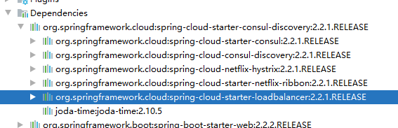

# Ribbon

## 1. 是什么？

Spring Cloud Ribbon 是基于 Netflix Ribbon 实现的一套***客户端负载均衡的工具***。 
简单的说，Ribbonn是Netflix的开源项目，主要功能是提供***客户端的软件负载均衡算法和服务调用***。

Ribbon客户端组件提供一系列完善的配置项，如连接超时，重试等。
就是在配置文件中列出 Loa Balancer后面所有机器，Ribbon会自动帮助你基于某种规则 (如简单轮询，随机连接等)去连接这些机器。

我们很容易使用Ribbon实现自定义的负载均衡算法。
 
 > [停更-官网地址](https://github.com/Netflix/ribbon)
 
 ## 2. 负载均衡区别
 
-  负载均衡(Load Balance)是将用户的请求平摊的分配到多个服务上，从而达到HA(高可用)，常见的负载均衡有 Nginx,LVS,硬件F5等。

- Ribbon与常见的不同是本地负载均衡客户端

 Ribbon 是本地负载均衡，在微服务调用接口时，在注册中心上获取注册信息服务列表之后缓存在JVM本地，从而实现本地RPC远程服务调用技术。

- Nginx 服务端负载均衡

客户端所有请求都会交给nginx，然后由nginx实现请求转发，即负载均衡是由服务端实现的。


负载均衡+RestTemplate调用,Ribbon工作时有两步:
1. 先选择 EurekaServer，优先选择统一区域负载较少的 server
2. 再根据用户指定的策略，从server取到的服务注册列表中选择一个地址。

>  其中 Riibon 提供了多种策略（轮询，随机，根据响应时间加权）。

## 3. 使用

在客户端 `spring-cloud-demo-consumer-order` 加入负载均衡依赖，然后启动多个`spring-cloud-demo-provider-payment` 提供服务

### 3.1 添加依赖pom

可以看到在服务发现的jar 中已经包含了负载均衡的ribbon和loadbalance



### 3.2 添加注解

- @LoadBalanced 默认是轮询

```java
package top.freshgeek.springcloud.order.config;

import org.springframework.cloud.client.loadbalancer.LoadBalanced;
import org.springframework.context.annotation.Bean;
import org.springframework.context.annotation.Configuration;
import org.springframework.web.client.RestTemplate;

/**
 * @author chen.chao
 * @version 1.0
 * @date 2020/4/29 10:29
 * @description
 */
@Configuration
public class RestConfig {

    @Bean
    @LoadBalanced
    public RestTemplate restTemplate(){
        return new RestTemplate();
    }

}

```

### 3.3 启动测试

这里需要复制多份 spring-cloud-demo-provider-payment 启动配置

- application-cluster1.yml
- application-cluster2.yml
- application-cluster3.yml

因为刚搭建consul 所以 这里选择连consul ，然后启动三份  spring-cloud-demo-provider-payment 

最后启动一下 spring-cloud-demo-consumer-order 消费者

可以观察到三个服务轮询打印sql


## 4. 进阶：修改负载均衡规则

在jar包中默认提供了7种均衡方式：
- RoundRobinRule 轮询
- RandomRule 随机
- RetryRule 先按照RoundRobinRule的 策略获取服务，如果获取服务失败则在指定时间里进行重试，获取可用服务
- WeightedResponseTimeRule 对RoundRobinRule的扩展，响应速度越快，实例选择权重越大 ，越容易被选择
- BestAvailableRule 会先过滤掉由于多次访问故障而处于断路器 跳闸状态的服务，然后选择一个并发一个最小的服务
- BestAvaibilityFilteringRule 先过滤掉故障实例，再选择并发量较小的实例
- ZoneAvoidanceRule 默认规则，符合server所在区域的性能和server的可用性选择服务器

1. 配置类

```java
package top.freshgeek.springcloud.rule;

import com.netflix.loadbalancer.*;
import org.springframework.context.annotation.Bean;
import org.springframework.context.annotation.Configuration;

/**
 * @author chen.chao
 * @version 1.0
 * @date 2020/5/2 14:08
 * @description 不能放在容器扫描类下 及子包中
 */
@Configuration
public class MyRuleConfig {

	@Bean
	public IRule rule() {
		// 默认
		RoundRobinRule roundRobinRule = new RoundRobinRule();
		RandomRule randomRule = new RandomRule();
		RetryRule retryRule = new RetryRule();
		WeightedResponseTimeRule weightedResponseTimeRule = new WeightedResponseTimeRule();
		BestAvailableRule bestAvailableRule = new BestAvailableRule();
		AvailabilityFilteringRule availabilityFilteringRule = new AvailabilityFilteringRule();
		ZoneAvoidanceRule zoneAvoidanceRule = new ZoneAvoidanceRule();
		return randomRule;
	}

}

```


> 注意：  不能被@ComponentScan扫描到， 也就是不能放在启动类子包下面

2. 再配置上指定客户端关联

```java
@RibbonClient(name = OrderTemplateController.PAY_SERVICE, configuration = MyRuleConfig.class)
```


## 5. 手写配置规则

可以模拟如：`com.netflix.loadbalancer.RoundRobinRule` 继承 `com.netflix.loadbalancer.AbstractLoadBalancerRule`
 
主要实现`com.netflix.loadbalancer.IRule` 接口即可 

```java

package com.netflix.loadbalancer;

public interface IRule {
    Server choose(Object var1);

    void setLoadBalancer(ILoadBalancer var1);

    ILoadBalancer getLoadBalancer();
}

```

