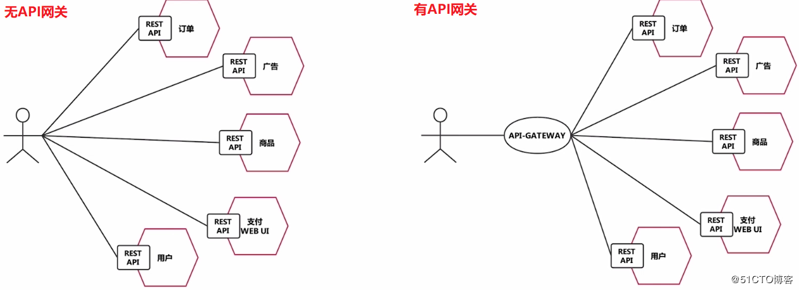
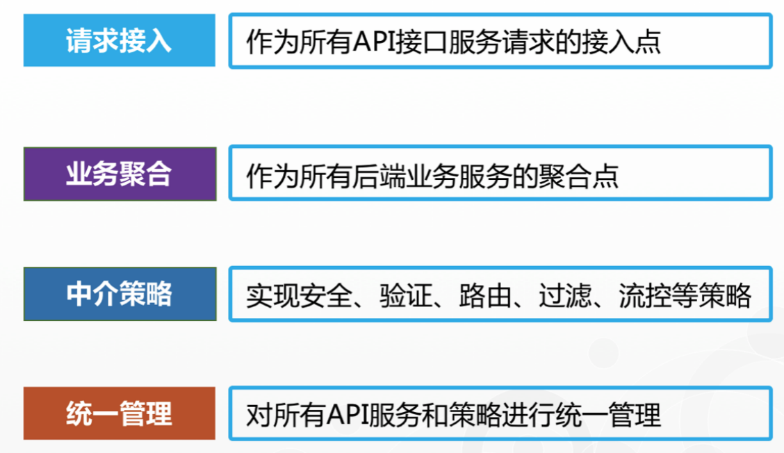

# gateway 

在之前springcloud提供的网关是zull，zuul基于servlet2.5，使用阻塞架构，不支持长连接。
zuul除了编程语言不同和nginx相似，
zuul已经发布了zuul2，支持长连接，非阻塞，
但是springcloud还没有整合(自己偷偷搞了gateway，怎么可能还会理zuul2)。

gateway 基于Spring 5.0的新特性WebFlux进行开发，底层网络通信框架使用的是Netty，所以其吞吐量高、性能强劲


>  几个对网关概念解释不错的博文
>- [https://blog.csdn.net/rain_web/article/details/102469745](https://blog.csdn.net/rain_web/article/details/102469745)
>- [https://blog.51cto.com/zero01/2173327](https://blog.51cto.com/zero01/2173327)


## 解决痛点

我们都知道在微服务架构中，系统会被拆分为很多个微服务。
那么作为客户端要如何去调用这么多的微服务呢？
难道要一个个的去调用吗？
很显然这是不太实际的，我们需要有一个统一的接口与这些微服务打交道，这就是我们需要服务网关的原因。

 

网关的角色是作为一个 API 架构，用来保护、增强和控制对于 API 服务的访问。

API 网关是一个处于应用程序或服务（提供 REST API 接口服务）之前的系统，用来管理授权、访问控制和流量限制等，这样 REST API 接口服务就被 API 网关保护起来，对所有的调用者透明。因此，隐藏在 API 网关后面的业务系统就可以专注于创建和管理服务，而不用去处理这些策略性的基础设施。



> 官方网站 [https://cloud.spring.io/spring-cloud-static/spring-cloud-gateway/2.2.2.RELEASE/reference/html/](https://cloud.spring.io/spring-cloud-static/spring-cloud-gateway/2.2.2.RELEASE/reference/html/)

# 三个核心概念

- Route（路由） 网关的基本构建块。它由ID，目标URI，谓词集合和过滤器集合定义。如果断言为true，则匹配路由。
- Predicate（断言） 这是Java 8 Function谓词。输入类型是Spring FrameworkServerWebExchange。这使您可以匹配HTTP请求中的所有内容，例如标头或参数。
- Filter（过滤器） 这些是使用特定工厂构造的Spring FrameworkGatewayFilter实例。在这里，您可以在发送下游请求之前或之后修改请求和响应。

# 开始实际编码

新建工程 spring-cloud-demo-gateway

## 1.1 引入pom
```xml
    <!--gateway-->
        <!-- 注意不要添加 web的依赖，与gateway里的web flux冲突 -->
        <dependency>
            <groupId>org.springframework.cloud</groupId>
            <artifactId>spring-cloud-starter-gateway</artifactId>
        </dependency>
        <!--eureka-client-->
        <dependency>
            <groupId>org.springframework.cloud</groupId>
            <artifactId>spring-cloud-starter-netflix-eureka-client</artifactId>
        </dependency>
        <!-- 引入自己定义的api通用包，可以使用Payment支付Entity -->
        <dependency>
            <groupId>top.freshgeek.springcloud</groupId>
            <artifactId>spring-cloud-demo-common</artifactId>
            <version>${project.version}</version>
        </dependency>
        <!--一般基础配置类-->
        <dependency>
            <groupId>org.springframework.boot</groupId>
            <artifactId>spring-boot-devtools</artifactId>
            <scope>runtime</scope>
            <optional>true</optional>
        </dependency>
        <dependency>
            <groupId>org.projectlombok</groupId>
            <artifactId>lombok</artifactId>
            <optional>true</optional>
        </dependency>
        <dependency>
            <groupId>org.springframework.boot</groupId>
            <artifactId>spring-boot-starter-test</artifactId>
            <scope>test</scope>
        </dependency>
```

## 1.2 写yml

> 两个都写了下，我这还是用consul演示 省得启动那么多服务

```yaml

server:
  port: 9527

spring:
  application:
    name: cloud-gateway-service
  cloud:
    consul:
      host: consul
      port: 8500
      discovery:
        service-name: ${spring.application.name}
        # 心跳检测默认是关，需要打开
        heartbeat:
          enabled: true
eureka:
  instance:
    hostname: ${spring.application.name}
  client: #服务提供者provider注册进eureka服务列表内
    service-url:
      register-with-eureka: true
      fetch-registry: true
      defaultZone: http://eureka01:8761/eureka/,http://eureka02:8762/eureka/
```

## 1.3 启动类

```java

package top.freshgeek.springcloud.gateway;

import org.springframework.boot.SpringApplication;
import org.springframework.boot.autoconfigure.SpringBootApplication;
import org.springframework.boot.autoconfigure.jdbc.DataSourceAutoConfiguration;
import org.springframework.cloud.client.discovery.EnableDiscoveryClient;
import org.springframework.cloud.netflix.eureka.EnableEurekaClient;

/**
 * @author chen.chao
 */
@EnableDiscoveryClient
@SpringBootApplication
public class GatewayApplication {
	public static void main(String[] args) {
		SpringApplication.run(GatewayApplication.class, args);
	}

}

```

## 1.4 配置路由规则

网关基本不涉及到业务逻辑，主要就是配置网关规则，如：
- 动态路由
- 时间断言
- URL请求断言
- 过滤器配置

### 1.4.1 配置文件方式

> 这里推荐使用配置文件的方式去配置,因为后面我们可以结合配置中心做配置中心的动态配置
> ,同时把配置能力下移,交由各个微服务提供者设定自己的限流访问规则


```yaml
server:
  port: 9527

spring:
  application:
    name: cloud-gateway-service
  cloud:
    gateway:
      discovery:
        locator:
          enabled: true #开启从注册中心动态创建路由的功能，利用微服务名进行路由
      routes:
        - id: payment_routh #payment_route    #路由的ID，没有固定规则但要求唯一，建议配合服务名
          #uri: http://localhost:8001          #匹配后提供服务的路由地址
          uri: lb://cloud-payment-service #匹配后提供服务的路由地址
          predicates:
            - Path=/payment/get/**         # 断言，路径相匹配的进行路由
        - id: payment_routh2 #payment_route    #路由的ID，没有固定规则但要求唯一，建议配合服务名
          #uri: http://localhost:8001          #匹配后提供服务的路由地址
          uri: lb://cloud-payment-service #匹配后提供服务的路由地址
          predicates:
            - Path=/payment/lb/**         # 断言，路径相匹配的进行路由
            #- After=2020-12-01T15:51:37.485+08:00[Asia/Shanghai]
            #- Cookie=username,zzyy
            #- Header=X-Request-Id, \d+  # 请求头要有X-Request-Id属性并且值为整数的正则表达式
```


### 1.4.2 编程式

> 编程式的与配置文件方式也类似,把对应的路由和断言改成了对象而已

```java
package top.freshgeek.springcloud.gateway.config;

import org.springframework.cloud.gateway.route.RouteLocator;
import org.springframework.cloud.gateway.route.builder.RouteLocatorBuilder;
import org.springframework.context.annotation.Bean;
import org.springframework.context.annotation.Configuration;

/**
 * @author chen.chao
 */
@Configuration
public class GatewayConfig {


	@Bean
	public RouteLocator routeLocator(RouteLocatorBuilder routeLocatorBuilder) {
		RouteLocatorBuilder.Builder routes = routeLocatorBuilder.routes();
		// 对应
		// spring.cloud.gateway.routes
		// 一个id   一个path - 一个uri
		routes.route("path_route_baidu", r -> r.path("/guonei")
				.uri("http://news.baidu.com/guonei"))
		;

		return routes.build();
	}
}

```

## 1.5 测试

直接访问网关 

- http://localhost:9527/payment/get/2

达成与访问 spring-cloud-demo-provider-payment 效果一致

