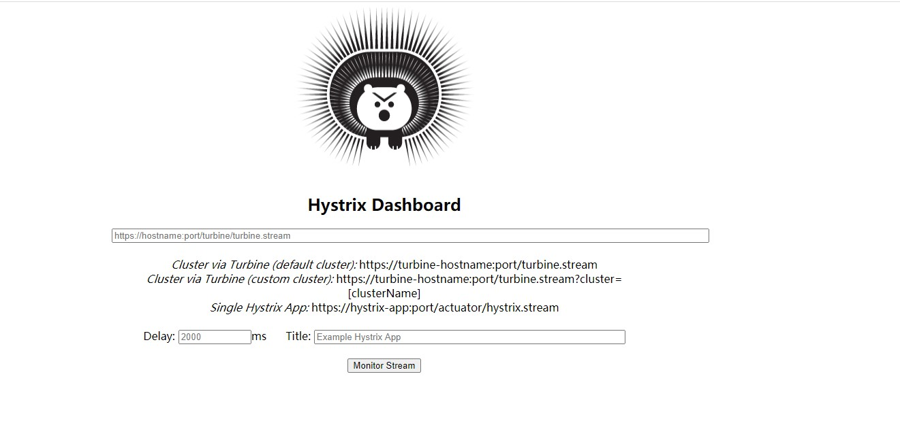
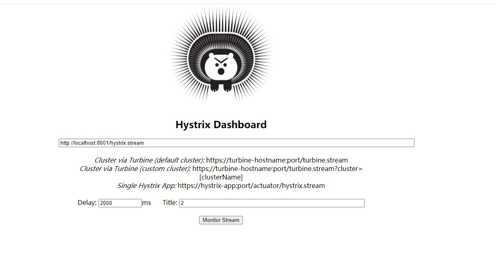
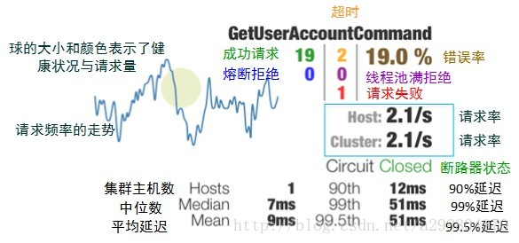
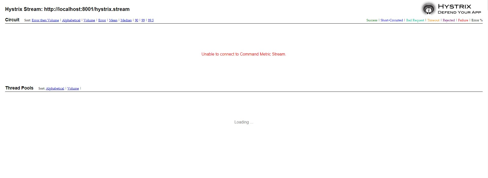
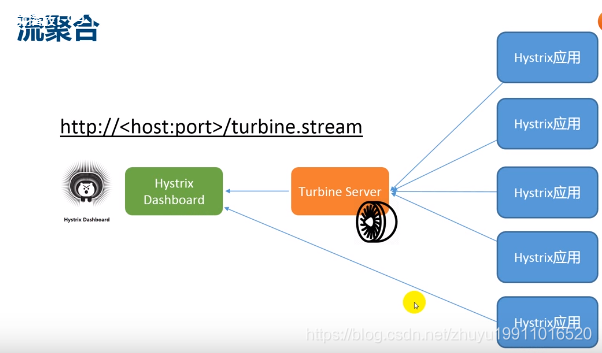
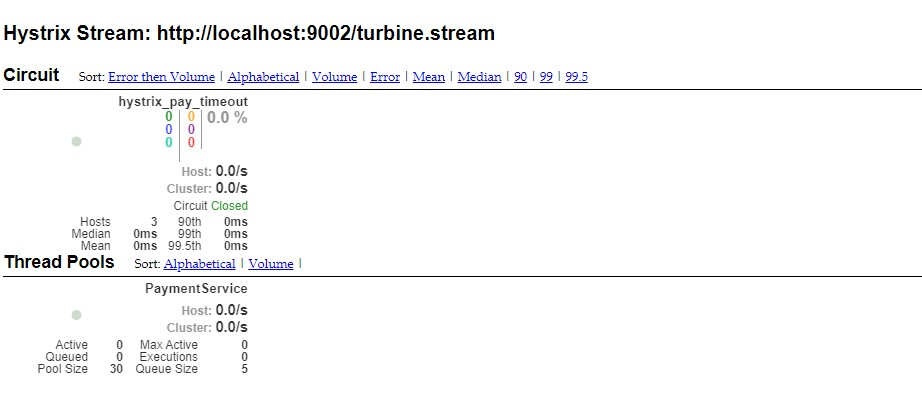

# 微服务痛点

复杂分布式系统中的应用程序有数十个依赖关系，每个依赖关系在某些时候不可避免的失败。

多个微服务之间调用时，假设 A 调B和C，B和C又调其他微服务，就是所谓的扇出。当扇出的链路上某个微服务响应时间过长或不可用对A的调用就会占用越来越多的资源，进而引起系统崩溃 ，所谓的雪崩效应。


# Histrix 服务
> 附上不错的博客详解：[https://blog.csdn.net/loushuiyifan/article/details/82702522](https://blog.csdn.net/loushuiyifan/article/details/82702522)

Hystrix [hɪst'rɪks]，中文含义是豪猪，因其背上长满棘刺，从而拥有了自我保护的能力。本文所说的Hystrix是Netflix开源的一款容错框架，同样具有自我保护能力。为了实现容错和自我保护，下面我们看看Hystrix如何设计和实现的。

Hystrix设计目标：
- 对来自依赖的延迟和故障进行防护和控制——这些依赖通常都是通过网络访问的
- 阻止故障的连锁反应
- 快速失败并迅速恢复
- 回退并优雅降级
- 提供近实时的监控与告警

Hystrix遵循的设计原则：

- 防止任何单独的依赖耗尽资源（线程）
- 过载立即切断并快速失败，防止排队
- 尽可能提供回退以保护用户免受故障
- 使用隔离技术（例如隔板，泳道和断路器模式）来限制任何一个依赖的影响
- 通过近实时的指标，监控和告警，确保故障被及时发现
- 通过动态修改配置属性，确保故障及时恢复
- 防止整个依赖客户端执行失败，而不仅仅是网络通信

Hystrix如何实现这些设计目标？

- 使用命令模式将所有对外部服务（或依赖关系）的调用包装在HystrixCommand或HystrixObservableCommand对象中，并将该对象放在单独的线程中执行；
- 每个依赖都维护着一个线程池（或信号量），线程池被耗尽则拒绝请求（而不是让请求排队）。
- 记录请求成功，失败，超时和线程拒绝。
- 服务错误百分比超过了阈值，熔断器开关自动打开，一段时间内停止对该服务的所有请求。
- 请求失败，被拒绝，超时或熔断时执行降级逻辑。
- 近实时地监控指标和配置的修改。


简单来说，Hystrix 是处理分布式系统的延迟和容错的开源库，保证一个依赖出现问题时不会导致整体服务失败，
避免级联故障，以提高分布式系统弹性。 断路器本身是一种开关装置，
当某个服务单元发生故障后，通过断路器的故障监控，向调用方返回一个符合预期的可处理的备选响应，
而不是长时间的等待或抛出调用方法无法处理的异常 。

# 1. 重要概念
- 服务降级 

服务端出现问题时（
程序运行异常 
， 超时
，服务熔断触发服务降级
，线程池/信号量打满）不让客户端等待并立即返回一个友好的提示（俗称：有个兜底的）。

- 服务熔断

当服务端达到了最大访问量时，多余请求过来也没空处理，可能还会造成底层服务宕机，因此直接拒绝访问，呈现出拒绝访问情况（相当于保险丝断了）

同时

- 服务限流

如秒杀类的高并发操作，请求直接全部进来，会造成服务宕机，因此禁止全部过来，而是限定一秒多少个请求有序进行


# 2. 实际编码

这里同样使用订单和支付作为示例：
- spring-cloud-demo-provider-payment 服务端
- spring-cloud-demo-consumer-order  客户端

在客户端做后面可以针对客户端做统一配置，通常降级都是在客户端做，但是同样我们也可以在服务端做，这里先简单介绍服务端的：

## 2.1 服务端降级兜底

- spring-cloud-demo-provider-payment

1. 引入pom 

```xml

<dependency>
    <groupId>org.springframework.cloud</groupId>
    <artifactId>spring-cloud-starter-netflix-hystrix</artifactId>
</dependency>

```

2. 添加注解 `@EnableCircuitBreaker`  开启熔断器

3. 编写业务代码

```java
package top.freshgeek.springcloud.payment.service;

import cn.hutool.core.util.IdUtil;
import com.netflix.hystrix.contrib.javanica.annotation.HystrixCommand;
import com.netflix.hystrix.contrib.javanica.annotation.HystrixProperty;
import com.netflix.ribbon.proxy.annotation.Hystrix;
import lombok.extern.slf4j.Slf4j;
import org.springframework.beans.factory.annotation.Autowired;
import org.springframework.beans.factory.annotation.Value;
import org.springframework.cloud.commons.util.IdUtils;
import org.springframework.stereotype.Service;
import org.springframework.util.Assert;
import top.freshgeek.springcloud.common.payment.CommonResult;
import top.freshgeek.springcloud.entity.payment.Payment;
import top.freshgeek.springcloud.payment.dao.PaymentJpaRepository;

import java.util.Optional;
import java.util.concurrent.TimeUnit;

/**
 * @author chen.chao
 * @version 1.0
 * @date 2020/4/29 9:27
 * @description
 */
@Slf4j
@Service
public class PaymentService {

	@Autowired
	private PaymentJpaRepository paymentJpaRepository;

	@Value("${server.port}")
	private Integer serverPort;

	public CommonResult get(long arg) {
		Optional<Payment> byId = paymentJpaRepository.findById(arg);
		log.debug("查询[{}]到数据[{}]", arg, byId);
		return !byId.isPresent() ? CommonResult.of(501, "没有查询到结果") : CommonResult.ofSuccess(byId.get());
	}

	public CommonResult save(Payment arg) {
		Payment save = paymentJpaRepository.save(arg);
		log.debug("保存数据[{}]", save);
		return CommonResult.ofSuccess(save);
	}

	public CommonResult hystrix_pay() {
		return CommonResult.of(200, "hystrix_pay : " + serverPort);
	}
	// --------------------- 服务降级 -----------------------------------------

	@HystrixCommand(fallbackMethod = "fallbackMethod", commandProperties = {
			@HystrixProperty(name = "execution.isolation.thread.timeoutInMilliseconds", value = "1000")
	})
	public CommonResult hystrix_pay_timeout() {
		try {
			TimeUnit.SECONDS.sleep(3);
		} catch (InterruptedException e) {
			e.printStackTrace();
		}
		return CommonResult.of(200, "hystrix_pay_timeout : " + serverPort);
	}


	public CommonResult fallbackMethod() {
		return CommonResult.of(201, "fallbackMethod :" + serverPort);
	}
	// --------------------- 服务降级 -----------------------------------------
 
}
// ---------------------- controller ---------------加入调用降级方法


package top.freshgeek.springcloud.payment.controller;

import lombok.extern.slf4j.Slf4j;
import org.springframework.beans.factory.annotation.Autowired;
import org.springframework.cloud.client.ServiceInstance;
import org.springframework.cloud.client.discovery.DiscoveryClient;
import org.springframework.web.bind.annotation.*;
import top.freshgeek.springcloud.common.payment.CommonResult;
import top.freshgeek.springcloud.entity.payment.Payment;
import top.freshgeek.springcloud.payment.service.PaymentService;

import java.util.List;


/**
 * @author chen.chao
 * @version 1.0
 * @date 2020/4/29 9:27
 * @description
 */
@Slf4j
@RequestMapping("/payment/")
@RestController
public class PaymentController {

	@Autowired
	private PaymentService paymentService;

	@Autowired(required = false)
	private DiscoveryClient discoveryClient;

	@PostMapping("/create")
	public CommonResult create(@RequestBody Payment payment) {
		return paymentService.save(payment);
	}

	@GetMapping("/get/{id}")
	public CommonResult getById(@PathVariable("id") long id) {
		return paymentService.get(id);
	}

	@GetMapping("pay")
	public CommonResult hystrixPay() {
		return paymentService.hystrix_pay();
	}

	@GetMapping("pay-timeout")
	public CommonResult hystrixPayTimeout() {
		return paymentService.hystrix_pay_timeout();
	} 

}

```
这里就是两个注解：
- @HystrixCommand 指明兜底方法和属性
- @HystrixProperty 其中属性`execution.isolation.thread.timeoutInMilliseconds`表明运行超过1秒会触发降级

### 2.1.1 全部属性：

com.netflix.hystrix.HystrixCommandProperties.HystrixCommandProperties(com.netflix.hystrix.HystrixCommandKey, com.netflix.hystrix.HystrixCommandProperties.Setter, java.lang.String)

我们可以直接启动服务调用这个服务类Controller ， 因为加了sleep 3秒 所以肯定会降级返回降级方法

## 2.2 客户端降级

服务端是不可能知道所有客户端调用方的需求，不知道他们需要多少秒返回信息，因此正常需求是：

在客户端调用服务端，服务端响应不及时或者出错等情况，客户端应该自己处理这种异常情况

因此我们改下 spring-cloud-demo-provider-payment ，把自己降级变成5秒兜底 ， 基本情况下不会自己出错了 ，
 然后加入一个异常

> int i = 10 / 0;

接着开始改造客户端 spring-cloud-demo-consumer-order

1. 加入hystrix pom

```xml
   <dependency>
            <groupId>org.springframework.cloud</groupId>
            <artifactId>spring-cloud-starter-netflix-hystrix</artifactId>
        </dependency>
```

2. 开启注解 @EnableHystrix

3. 编写业务类

```java

package top.freshgeek.springcloud.order.controller;

import com.netflix.hystrix.contrib.javanica.annotation.DefaultProperties;
import com.netflix.hystrix.contrib.javanica.annotation.HystrixCommand;
import com.netflix.hystrix.contrib.javanica.annotation.HystrixProperty;
import lombok.extern.slf4j.Slf4j;
import org.springframework.beans.factory.annotation.Autowired;
import org.springframework.web.bind.annotation.*;
import org.springframework.web.client.RestTemplate;
import top.freshgeek.springcloud.common.payment.CommonResult;
import top.freshgeek.springcloud.entity.payment.Payment;
import top.freshgeek.springcloud.order.feign.PaymentService;

import javax.annotation.Resource;

/**
 * @author chen.chao
 * @version 1.0
 * @date 2020/4/29 10:28
 * @description
 */
@Slf4j
@RestController
@RequestMapping("/feign/")
public class OrderOpenFeignController {

	public static final String PAY_SERVICE = "CLOUD-PAYMENT-SERVICE";

	@Resource
	private PaymentService paymentService;

	@GetMapping("payment/get/{id}")
	public CommonResult getPayment(@PathVariable("id") int id) {
		return paymentService.getById(id);
	}

	@PostMapping("payment/create")
	public CommonResult getPayment(Payment payment) {
		return paymentService.create(payment);
	}


	@GetMapping("/payment/pay")
	CommonResult hystrixPay() {
		return paymentService.hystrixPay();
	}

	@GetMapping("/payment/pay-timeout")
	@HystrixCommand(fallbackMethod = "fallbackMethod", commandProperties = {
			@HystrixProperty(name = "execution.isolation.thread.timeoutInMilliseconds", value = "1000")
	})
	CommonResult hystrixPayTimeout() {
		return paymentService.hystrixPayTimeout();
	}
	public CommonResult fallbackMethod() {
		return CommonResult.of(202, "fallbackMethod :" + "我是80 我为自己代言");
	}
 
}

```


>这里我省略了加 open feign 方法步骤 ， 正常情况先加了才能调用

与上面套路一致，加入了两个注解然后自己写一个超时方法自己兜底

4. 开启注册发现和服务端，客户端 测试调用这个报错方法，然后报错走兜底方法

## 2.3 耦合问题

思考一下：如果每个方法都需要这样，那么和业务方法耦合太严重了，且每一个微服务方法都需要加兜底太麻烦

### 2.3.1 全局异常兜底

兜底方法太多，就引入了全局兜底方法，使用方法如下：

1. 引入注解 @DefaultProperties

```java
package top.freshgeek.springcloud.order.controller;

import com.netflix.hystrix.contrib.javanica.annotation.DefaultProperties;
import com.netflix.hystrix.contrib.javanica.annotation.HystrixCommand;
import com.netflix.hystrix.contrib.javanica.annotation.HystrixProperty;
import lombok.extern.slf4j.Slf4j;
import org.springframework.beans.factory.annotation.Autowired;
import org.springframework.web.bind.annotation.*;
import org.springframework.web.client.RestTemplate;
import top.freshgeek.springcloud.common.payment.CommonResult;
import top.freshgeek.springcloud.entity.payment.Payment;
import top.freshgeek.springcloud.order.feign.PaymentService;

import javax.annotation.Resource;

/**
 * @author chen.chao
 * @version 1.0
 * @date 2020/4/29 10:28
 * @description
 */
@Slf4j
@DefaultProperties(defaultFallback = "globalFallBackTimeOut")
@RestController
@RequestMapping("/feign/")
public class OrderOpenFeignController {

	public static final String PAY_SERVICE = "CLOUD-PAYMENT-SERVICE";

	@Resource
	private PaymentService paymentService;

	@GetMapping("payment/get/{id}")
	public CommonResult getPayment(@PathVariable("id") int id) {
		return paymentService.getById(id);
	}

	@PostMapping("payment/create")
	public CommonResult getPayment(Payment payment) {
		return paymentService.create(payment);
	}


	@GetMapping("/payment/pay")
	CommonResult hystrixPay() {
		return paymentService.hystrixPay();
	}

	@GetMapping("/payment/pay-timeout")
//	@HystrixCommand(fallbackMethod = "fallbackMethod", commandProperties = {
//			@HystrixProperty(name = "execution.isolation.thread.timeoutInMilliseconds", value = "1000")
//	})
	@HystrixCommand
	CommonResult hystrixPayTimeout() {
		return paymentService.hystrixPayTimeout();
	}

	public CommonResult fallbackMethod() {
		return CommonResult.of(202, "fallbackMethod :" + "我是80 我为自己代言");
	}

	public CommonResult globalFallBackTimeOut() {
		return CommonResult.of(9001, "全局服务超时,请稍后再试");
	}

}

```

这样就可以有一个全局的兜底处理方法 ， 但是很明显这样还是不足：
1. 还是与业务代码耦合
2. 所有方法不能都是一样的签名，签名不同兜底方法就会出现错误

### 2.3.2 解耦合
针对上面两个问题，于是有了新的解决方案：fallback 实现类

```java
package top.freshgeek.springcloud.order.feign;


import org.springframework.cloud.openfeign.FeignClient;
import org.springframework.stereotype.Component;
import org.springframework.web.bind.annotation.*;
import top.freshgeek.springcloud.common.payment.CommonResult;
import top.freshgeek.springcloud.entity.payment.Payment;
import top.freshgeek.springcloud.order.controller.OrderOpenFeignController;
import top.freshgeek.springcloud.order.feign.fallback.FallbackPaymentService;

/**
 * @author chen.chao
 */
@Component
@FeignClient(value = OrderOpenFeignController.PAY_SERVICE, fallback = FallbackPaymentService.class)
public interface PaymentService {

	@PostMapping("/payment/create")
	CommonResult create(@RequestBody Payment payment);

	@GetMapping("/payment/get/{id}")
	CommonResult getById(@PathVariable("id") long id);

	@GetMapping("/payment/pay")
	CommonResult hystrixPay();

	@GetMapping("/payment/pay-timeout")
	CommonResult hystrixPayTimeout();

	@GetMapping("/pay/{id}")
	CommonResult payById(@PathVariable("id") int id);
}

```

> @FeignClient(value = OrderOpenFeignController.PAY_SERVICE, fallback = FallbackPaymentService.class)

```java
package top.freshgeek.springcloud.order.feign.fallback;

import org.springframework.stereotype.Component;
import top.freshgeek.springcloud.common.payment.CommonResult;
import top.freshgeek.springcloud.entity.payment.Payment;
import top.freshgeek.springcloud.order.feign.PaymentService;

/**
 * @author chen.chao
 */
@Component
public class FallbackPaymentService implements PaymentService {

	@Override
	public CommonResult create(Payment payment) {
		return null;
	}

	@Override
	public CommonResult getById(long id) {
		return null;
	}

	@Override
	public CommonResult hystrixPay() {
		return CommonResult.of(209, "活动已关闭,请下次再来");
	}

	@Override
	public CommonResult hystrixPayTimeout() {
		return null;
	}

	@Override
	public CommonResult payById(int id) {
		return null;
	}
}
```

在feign 接口上表明兜底类，然后兜底类实现feign 接口 , 这样就完成了对兜底方法与业务方法解耦合，但是又引入了新的问题：

1. 所有接口兜底方法都要自己实现一遍 

是不是感觉回到了第一步，但是与第一步区别就是完成了解耦合

### 2.3.3 aop 全局兜底+特定兜底

课程上面这里没有接着讲，我这里选择是用aop方法，对fallback包中的方法统一兜底

1. 开启aop注解 @EnableAspectJAutoProxy

2. 添加切面类

```java
package top.freshgeek.springcloud.order.aspect;

import org.aspectj.lang.ProceedingJoinPoint;
import org.aspectj.lang.annotation.Around;
import org.aspectj.lang.annotation.Aspect;
import org.aspectj.lang.annotation.Pointcut;
import org.springframework.context.annotation.Configuration;
import top.freshgeek.springcloud.common.payment.CommonResult;

import java.text.SimpleDateFormat;
import java.util.ArrayList;
import java.util.List;

/**
 * @author chen.chao
 */
@Aspect
@Configuration
public class FallbackAspect {
	/**
	 * 这里我们使用注解的形式
	 * 当然，我们也可以通过切点表达式直接指定需要拦截的package,需要拦截的class 以及 method
	 * 切点表达式:   execution(...)
	 */
	@Pointcut("execution( * top.freshgeek.springcloud.order.feign.fallback..*(..))")
	public void logPointCut() {
	}
	/**
	 * 环绕通知 @Around  ， 当然也可以使用 @Before (前置通知)  @After (后置通知)
	 *
	 * @param point
	 * @return
	 * @throws Throwable
	 */
	@Around("logPointCut()")
	public Object around(ProceedingJoinPoint point) throws Throwable {
		Object proceed = point.proceed();
		return proceed == null ? CommonResult.of(9007, "全局兜底降级,请稍后再试") : proceed;
	}
}
```

这里预留了空判断，也可以自己实现特定兜底 ， 也符合 全局控制+特例特写

# 3. 服务熔断

Circuit Breaker主要包括如下6个参数：

1、circuitBreaker.enabled

是否启用熔断器，默认是TRUE。
2 、circuitBreaker.forceOpen

熔断器强制打开，始终保持打开状态，不关注熔断开关的实际状态。默认值FLASE。
3、circuitBreaker.forceClosed
熔断器强制关闭，始终保持关闭状态，不关注熔断开关的实际状态。默认值FLASE。

4、circuitBreaker.errorThresholdPercentage
错误率，默认值50%，例如一段时间（10s）内有100个请求，其中有54个超时或者异常，那么这段时间内的错误率是54%，大于了默认值50%，这种情况下会触发熔断器打开。

5、circuitBreaker.requestVolumeThreshold

默认值20。含义是一段时间内至少有20个请求才进行errorThresholdPercentage计算。比如一段时间了有19个请求，且这些请求全部失败了，错误率是100%，但熔断器不会打开，总请求数不满足20。

6、circuitBreaker.sleepWindowInMilliseconds

半开状态试探睡眠时间，默认值5000ms。如：当熔断器开启5000ms之后，会尝试放过去一部分流量进行试探，确定依赖服务是否恢复。

 
## 3.1 代码实现

- spring-cloud-demo-provider-payment

```java

package top.freshgeek.springcloud.payment.service;

import cn.hutool.core.util.IdUtil;
import com.netflix.hystrix.contrib.javanica.annotation.HystrixCommand;
import com.netflix.hystrix.contrib.javanica.annotation.HystrixProperty;
import com.netflix.ribbon.proxy.annotation.Hystrix;
import lombok.extern.slf4j.Slf4j;
import org.springframework.beans.factory.annotation.Autowired;
import org.springframework.beans.factory.annotation.Value;
import org.springframework.cloud.commons.util.IdUtils;
import org.springframework.stereotype.Service;
import org.springframework.util.Assert;
import top.freshgeek.springcloud.common.payment.CommonResult;
import top.freshgeek.springcloud.entity.payment.Payment;
import top.freshgeek.springcloud.payment.dao.PaymentJpaRepository;

import java.util.Optional;
import java.util.concurrent.TimeUnit;

/**
 * @author chen.chao
 * @version 1.0
 * @date 2020/4/29 9:27
 * @description
 */
@Slf4j
@Service
public class PaymentService {

	@Autowired
	private PaymentJpaRepository paymentJpaRepository;

	@Value("${server.port}")
	private Integer serverPort;

	public CommonResult get(long arg) {
		Optional<Payment> byId = paymentJpaRepository.findById(arg);
		log.debug("查询[{}]到数据[{}]", arg, byId);
		return !byId.isPresent() ? CommonResult.of(501, "没有查询到结果") : CommonResult.ofSuccess(byId.get());
	}

	public CommonResult save(Payment arg) {
		Payment save = paymentJpaRepository.save(arg);
		log.debug("保存数据[{}]", save);
		return CommonResult.ofSuccess(save);
	}


	public CommonResult hystrix_pay() {
		return CommonResult.of(200, "hystrix_pay : " + serverPort);
	}
	// --------------------- 服务降级 -----------------------------------------

	@HystrixCommand(fallbackMethod = "fallbackMethod", commandProperties = {
			@HystrixProperty(name = "execution.isolation.thread.timeoutInMilliseconds", value = "5000")
	})
	public CommonResult hystrix_pay_timeout() {
		try {
			int i = 10 / 0;
			TimeUnit.SECONDS.sleep(3);
		} catch (InterruptedException e) {
			e.printStackTrace();
		}
		return CommonResult.of(200, "hystrix_pay_timeout : " + serverPort);
	}


	public CommonResult fallbackMethod() {
		return CommonResult.of(201, "fallbackMethod :" + serverPort);
	}
	// --------------------- 服务降级 -----------------------------------------

	// --------------------- 服务熔断 -----------------------------------------

	@HystrixCommand(fallbackMethod = "payByIdFallback", commandProperties = {
			@HystrixProperty(name = "circuitBreaker.enabled", value = "true"),// 是否开启断路器
			@HystrixProperty(name = "circuitBreaker.requestVolumeThreshold", value = "10"),// 请求次数
			@HystrixProperty(name = "circuitBreaker.sleepWindowInMilliseconds", value = "10000"), // 时间窗口期
			@HystrixProperty(name = "circuitBreaker.errorThresholdPercentage", value = "60"),// 失败率达到多少后跳闸
	})
	public CommonResult payById(Integer id) {
		Assert.isTrue(id > 0, "金额必须大于零");
		return CommonResult.of(200, "流水号:" + IdUtil.fastUUID() + "id :" + id);
	}

	public CommonResult payByIdFallback(Integer id) {
		return CommonResult.of(200, "id 不能负数，请稍后再试，/(ㄒoㄒ)/~~   id: " + id);
	}
	// --------------------- 服务熔断 -----------------------------------------

}
```

这样我们对id 限制 ，然后我们传id 来控制是不是异常 ，用来测试熔断效果

这里我们直接启动服务端，输入错误的和正确的去测试熔断

## 3.2 总结

### 3.2.1 熔断类型

- 熔断打开 请求不再进行调用当前服务，内部设有时钟一般为 MTTR，当打开时长达时钟则进入半熔断状态

- 熔断关闭 熔断关闭不会对服务进行熔断

- 熔断半开 根据规则调用当前服务，符合规则恢复正常，关闭熔断

### 3.2.2 什么时候打开

设计三个参数：时间窗，请求总阈值，错误百分比阈值

- 快照时间窗：默认为最近的10s

- 请求总数阈值：必须满足请求总阈值才有资格熔断。默认为20。意味着在10s内，如果命令调用次数不足20次，即使所有请求都超时或其他原因失败断路器都不会打开

- 错误百分比阈值：在快照时间窗内请求总数超过阈值，且错误次数占总请求次数的比值大于阈值，断路器将会打开


# 4 图形化界面 Dashboard

Hystrix 与eureka 思想一样 ， 想用服务先建工程，然后引入依赖，自己启动
创建新模块
- spring-cloud-demo-hystrix-dashboard

## 4.1 引入依赖

```java
  <dependency>
            <groupId>org.springframework.cloud</groupId>
            <artifactId>spring-cloud-starter-netflix-hystrix-dashboard</artifactId>
        </dependency>
        <dependency>
            <groupId>org.springframework.boot</groupId>
            <artifactId>spring-boot-starter-actuator</artifactId>
        </dependency>
        <dependency>
            <groupId>org.springframework.boot</groupId>
            <artifactId>spring-boot-devtools</artifactId>
            <scope>runtime</scope>
            <optional>true</optional>
        </dependency>
        <dependency>
            <groupId>org.projectlombok</groupId>
            <artifactId>lombok</artifactId>
            <optional>true</optional>
        </dependency>
        <dependency>
            <groupId>org.springframework.boot</groupId>
            <artifactId>spring-boot-starter-test</artifactId>
            <scope>test</scope>
        </dependency>
```

## 4.2 yml 配置文件

最简单的配置，指定端口9001 

```java
server:
  port: 9001
```

## 4.3 启动类注解 

@EnableHystrixDashboard

```java
package top.freshgeek.springcloud.hystrixdashboard;


import org.springframework.boot.SpringApplication;
import org.springframework.boot.autoconfigure.SpringBootApplication;
import org.springframework.cloud.netflix.hystrix.dashboard.EnableHystrixDashboard;

/**
 * @author chen.chao
 */
@SpringBootApplication
@EnableHystrixDashboard
public class HystrixDashboardApplication {
	public static void main(String[] args) {
		SpringApplication.run(HystrixDashboardApplication.class, args);
	}

}

```

然后启动 访问 `http://localhost:9001/hystrix`
 
 

然后启动 eureka 和 服务端 ,在路径中输入对应服务端的IP端口路径,如下:




## 4.4 对应的图表 含义




当然你可能看到 ：




那就要看下这个坑


## 4.5 eureka+hystrix-dashboard 坑

因为兼容性bug 需要在服务端 spring-cloud-demo-provider-payment 加入代码以适配

```java
	/**
	 *此配置是为了服务监控而配置，与服务容错本身无关，springcloud升级后的坑
	 *ServletRegistrationBean因为springboot的默认路径不是"/hystrix.stream"，
	 *只要在自己的项目里配置上下面的servlet就可以了
	 */
	@Bean
	public ServletRegistrationBean getServlet() {
		HystrixMetricsStreamServlet streamServlet = new HystrixMetricsStreamServlet();
		ServletRegistrationBean registrationBean = new ServletRegistrationBean(streamServlet);
		registrationBean.setLoadOnStartup(1);
		registrationBean.addUrlMappings("/hystrix.stream","/actuator/hystrix.stream");
		registrationBean.setName("HystrixMetricsStreamServlet");
		return registrationBean;
	}
```


## 4.6 loading 状态 

如果一直是loading 也没有报错 说明现在还没有服务，需要访问一下服务端的带有hystrix 的接口

Hystrix DashBoard监控的服务都是要求有带上熔断端点的，即带上@HystrixCommand注解的方法，调用没有熔断端点的方法没法得到监控。

## 4.7 集群负载均衡监控
我们不可能只监控一个实例，应该需要监控一个服务的全部实例 ， 所以这里需要引入
Turbine，通过它来汇集监控信息，并将信息提供给Hystrix Dashboard来集中展示



因此需要搭建 spring-cloud-demo-hystrix-dashboard-turbine ， 通过`spring-cloud-demo-hystrix-dashboard-turbine`
来聚合集群内的服务监控，统一输出到hystrix-dashboard

### 4.7.1 引入pom


> 因为电脑性能小 我就没去弄eureka 集群了 ， 还是沿用最后演示的consul 

```xml
    <!--SpringCloud consul-server-->
          <dependency>
              <groupId>org.springframework.cloud</groupId>
              <artifactId>spring-cloud-starter-consul-discovery</artifactId>
          </dependency>
          <!--SpringCloud consul-server-->
          <!-- turbine -->
          <dependency>
              <groupId>org.springframework.cloud</groupId>
              <artifactId>spring-cloud-starter-netflix-turbine</artifactId>
              <exclusions>
                  <exclusion>
                      <groupId>org.springframework.cloud</groupId>
                      <artifactId>spring-cloud-starter-netflix-eureka-client</artifactId>
                  </exclusion>
              </exclusions>
          </dependency>
          <!--hystrix熔断器-->
          <dependency>
              <groupId>org.springframework.cloud</groupId>
              <artifactId>spring-cloud-starter-netflix-hystrix</artifactId>
          </dependency>
          <dependency>
              <groupId>org.springframework.boot</groupId>
              <artifactId>spring-boot-starter-actuator</artifactId>
          </dependency>
```

### 4.7.2 修改yml

> 这里我两个都配了，选择其中一个注册发现即可
>
```yaml

server:
  port: 9002

turbine:
  #appConfig 配置Eureka中的serviceId列表，表明监控哪些服务，多个服务id用 ， 逗号隔开
  app-config: cloud-payment-service
  aggregator:
    cluster-config: default
  cluster-name-expression: new String("default")
spring:
  cloud:
    consul:
      host: 192.168.203.102
      port: 8500
      discovery:
        service-name: ${spring.application.name}
        # 心跳检测默认是关，需要打开
        heartbeat:
          enabled: true
eureka:
  client:
    register-with-eureka: true
    fetch-registry: true
    service-url:
      defaultZone: http://eureka01:8761/eureka/,http://eureka02:8762/eureka/
  instance:
    hostname: payment8001
    prefer-ip-address: true
    lease-renewal-interval-in-seconds: 1
    lease-expiration-duration-in-seconds: 2

```

### 4.7.3 主启动类

@EnableTurbine
@SpringCloudApplication

```java
package top.freshgeek.springcloud.hystrixdashboardturbine;

import org.springframework.boot.SpringApplication;
import org.springframework.boot.autoconfigure.SpringBootApplication;
import org.springframework.cloud.client.discovery.EnableDiscoveryClient;
import org.springframework.cloud.netflix.hystrix.dashboard.EnableHystrixDashboard;
import org.springframework.cloud.netflix.turbine.EnableTurbine;

/**
 * @author chen.chao
 */
@EnableTurbine
@SpringCloudApplication
public class HystrixDashboardTurbineApplication {
	public static void main(String[] args) {
		SpringApplication.run(HystrixDashboardTurbineApplication.class, args);
	}
}


``` 


### 4.7.4  启动测试

1. 启动注册发现服务
2. 启动生产者
3. 启动 监控
4. 启动turbine 
5. 访问带有熔断接口
6. 观察单个 ， 如： http://localhost:8002/hystrix.stream
7. 观察多个 ， 如： http://localhost:9002/turbine.stream



并且可以在hosts 中看到有多个，如果数量不对可能还没有访问到那个节点

