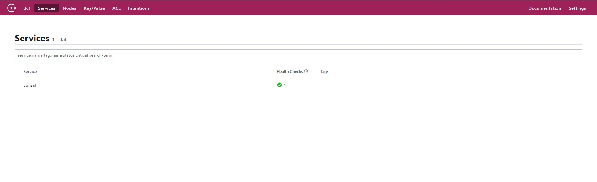

# consul 

## 功能特性
- 服务发现：Consul的客户端可以注册服务，例如 api或mysql，其他客户端可以使用Consul来发现给定服务的提供者。使用DNS或HTTP，应用程序可以轻松找到它们依赖的服务。

- 运行状况检查：领事客户端可以提供任何数量的运行状况检查，这些检查可以与给定服务（“ Web服务器返回200 OK”）或与本地节点（“内存利用率低于90％”）相关联。操作员可以使用此信息来监视群集的运行状况，服务发现组件可以使用此信息将流量路由到运行状况不佳的主机之外。

- KV商店：应用程序可以将Consul的分层键/值存储用于多种目的，包括动态配置，功能标记，协调，领导者选举等。简单的HTTP API使其易于使用。

- 安全的服务通信：领事可以为服务生成并分发TLS证书，以建立相互TLS连接。 意图 可用于定义允许哪些服务进行通信。可以使用可以实时更改的意图轻松管理服务分段，而不必使用复杂的网络拓扑和静态防火墙规则。

- 多数据中心：Consul开箱即用地支持多个数据中心。这意味着Consul的用户不必担心会构建其他抽象层以扩展到多个区域。


## 1. 安装consul 

首先安装consul ， 这里使用docker 安装

> 注意的是需要把 **-bind=** 地址绑定换成当前虚拟机的IP 

```shell script
docker run -d --net=host --name consul -e 'CONSUL_LOCAL_CONFIG={"skip_leave_on_interrupt": true}' consul:1.6.1 agent -server -bind=192.168.203.102 -bootstrap-expect=1 -ui -client=0.0.0.0
```

完成之后可以访问 IP：8500 




## 2. 修改pom依赖

- spring-cloud-demo-provider-payment
- spring-cloud-demo-consumer-order

```xml
<dependency>
   <groupId>org.springframework.cloud</groupId>
   <artifactId>spring-cloud-starter-consul-discovery</artifactId>
</dependency>
```


## 3. 改配置yml

- spring-cloud-demo-provider-payment

application-consul.yml

```yaml
server:
  port: 8005

spring:
  application:
    name: cloud-payment-service
  datasource:
    # 当前数据源操作类型
    type: com.alibaba.druid.pool.DruidDataSource
    # mysql驱动类
    driver-class-name: com.mysql.jdbc.Driver
    url: jdbc:mysql://data.keepon.site:3306/springcloud-payment?useUnicode=true&characterEncoding=UTF-8&useSSL=false&serverTimezone=GMT%2B8
    username: springcloud
    password: springcloud
  jpa:
    hibernate:
      ddl-auto: update
    show-sql: true
#### consul 注册中心  注解与zookeeper 一致
  cloud:
    consul:
      host: consul
      port: 8500
      discovery:
        service-name: ${spring.application.name}
        # 心跳检测默认是关，需要打开
        heartbeat:
          enabled: true
```

- spring-cloud-demo-consumer-order

application-consul.yml

```yaml
server:
  port: 80
spring:
  application:
    name: cloud-consumer-order
  #### consul 注册中心  注解与zookeeper 一致
  cloud:
    consul:
      host: consul
      port: 8500
      discovery:
        service-name: ${spring.application.name}
        # 心跳检测默认是关，需要打开
        heartbeat:
          enabled: true
```

## 4. 启动类注解

1. 同样在启动类加上 `@EnableDiscoveryClient` 注解即可

2. 添加配置profile `consul` 配置 启动 服务端+客户端

3. 启动完成之后 可以访问 http://localhost/consumer/payment/get/1 或 http://localhost/swagger-ui.html 测试完成客户端访问服务端

> consul 大小写服务名都能识别


