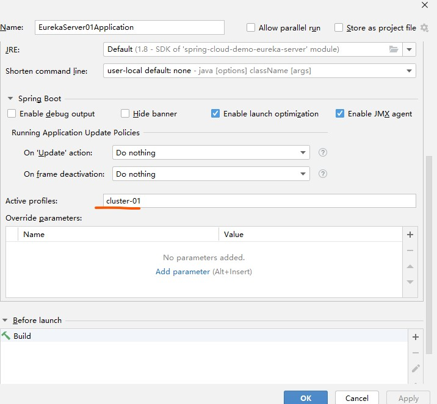
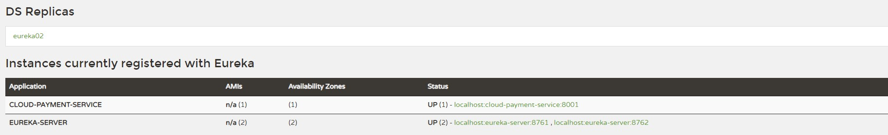
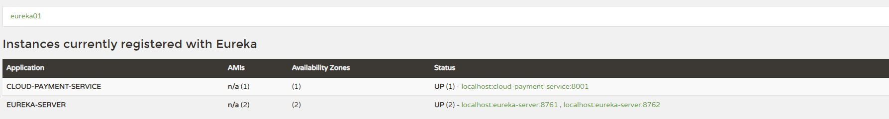

# Eureka 服务 


Eureka 是基于AP 的服务注册发现

## Eureka 自我保护机制

首先对Eureka注册中心需要了解的是Eureka各个节点都是平等的，没有ZK中角色的概念， 即使N-1个节点挂掉也不会影响其他节点的正常运行。

默认情况下，如果Eureka Server在一定时间内（默认90秒）没有接收到某个微服务实例的心跳，Eureka Server将会移除该实例。但是当网络分区故障发生时，微服务与Eureka Server之间无法正常通信，而微服务本身是正常运行的，此时不应该移除这个微服务，所以引入了自我保护机制。

- 官方对于自我保护机制的定义：

自我保护模式正是一种针对网络异常波动的安全保护措施，使用自我保护模式能使Eureka集群更加的健壮、稳定的运行。

- 自我保护机制的工作机制是：

如果在15分钟内超过85%的客户端节点都没有正常的心跳，那么Eureka就认为客户端与注册中心出现了网络故障，Eureka Server自动进入自我保护机制，此时会出现以下几种情况：

Eureka Server不再从注册列表中移除因为长时间没收到心跳而应该过期的服务。

Eureka Server仍然能够接受新服务的注册和查询请求，但是不会被同步到其它节点上，保证当前节点依然可用。

当网络稳定时，当前Eureka Server新的注册信息会被同步到其它节点中。

因此Eureka Server可以很好的应对因网络故障导致部分节点失联的情况，而不会像ZK那样如果有一半不可用的情况会导致整个集群不可用而变成瘫痪。

> 因此也很有可能出现 服务故障缺没有移除的情况
>

- 自我保护开关

Eureka自我保护机制，通过配置 eureka.server.enable-self-preservation 来true打开/false禁用自我保护机制，默认打开状态，建议生产环境打开此配置。
eviction-interval-timer-in-ms: 设定检测周期


## Eureka server 单机版

 `spring-cloud-demo-eureka-server` 工程提供 eureka server ，分三步

### 1. 引入pom文件

```xml
        <!--    这个是重点 ，引入eureka  -->
        <dependency>
            <groupId>org.springframework.cloud</groupId>
            <artifactId>spring-cloud-starter-netflix-eureka-server</artifactId>
        </dependency>
        <dependency>
            <groupId>org.springframework.boot</groupId>
            <artifactId>spring-boot-starter-web</artifactId>
        </dependency>
        <dependency>
            <groupId>org.springframework.boot</groupId>
            <artifactId>spring-boot-starter-actuator</artifactId>
        </dependency>
        <dependency>
            <groupId>io.springfox</groupId>
            <artifactId>springfox-swagger-ui</artifactId>
        </dependency>
        <dependency>
            <groupId>io.springfox</groupId>
            <artifactId>springfox-swagger2</artifactId>
        </dependency>
        <!--热部署-->
        <dependency>
            <groupId>org.springframework.boot</groupId>
            <artifactId>spring-boot-devtools</artifactId>
            <scope>runtime</scope>
            <optional>true</optional>
        </dependency>
        <dependency>
            <groupId>org.projectlombok</groupId>
            <artifactId>lombok</artifactId>
            <optional>true</optional>
        </dependency>
        <dependency>
            <groupId>org.springframework.boot</groupId>
            <artifactId>spring-boot-starter-test</artifactId>
            <scope>test</scope>
        </dependency>
```

### 2. 配置 application.yml

```yaml
server:
  port: 8761
eureka:
  instance:
    hostname: localhost
  client:
    # 不注册自己
    register-with-eureka: false
    # 维护 不检索
    fetch-registry: false
    service-url:
      defaultZone: http://${eureka.instance.hostname}:${server.port}/eureka/
  server:
    enable-self-preservation: false
    # 清理无效节点的时间间隔，默认60000毫秒，即60秒
    eviction-interval-timer-in-ms: 10
spring:
  freemarker:
    template-loader-path: classpath:/templates/
    prefer-file-system-access: false
```

### 3. 写启动类 EurekaServerApplication

> @EnableEurekaServer 重点就是这个

```java
package top.freshgeek.springcloud.eureka;

import org.springframework.boot.SpringApplication;
import org.springframework.boot.autoconfigure.SpringBootApplication;
import org.springframework.cloud.netflix.eureka.server.EnableEurekaServer;

/**
 * @author chen.chao
 * @version 1.0
 * @date 2020/4/29 11:31
 */
@EnableEurekaServer
@SpringBootApplication
public class EurekaServerApplication {
    public static void main(String[] args) {
        SpringApplication.run(EurekaServerApplication.class,args);
    }
}
```

### 启动日志

最后就可以启动了，可以在控制台看到很多日志打印，如下：

```text
2020-11-30 20:29:19.185  INFO 33572 --- [a-EvictionTimer] c.n.e.registry.AbstractInstanceRegistry  : Running the evict task with compensationTime 0ms
2020-11-30 20:29:19.196  INFO 33572 --- [a-EvictionTimer] c.n.e.registry.AbstractInstanceRegistry  : Running the evict task with compensationTime 1ms
2020-11-30 20:29:19.207  INFO 33572 --- [a-EvictionTimer] c.n.e.registry.AbstractInstanceRegistry  : Running the evict task with compensationTime 0ms
2020-11-30 20:29:19.218  INFO 33572 --- [a-EvictionTimer] c.n.e.registry.AbstractInstanceRegistry  : Running the evict task with compensationTime 1ms
```

这是正常的检测，在检测不正常的节点剔除，如果不想看到可以调整日志级别屏蔽，如：

```yaml
logging:
  level:
    com:
      netflix:
        eureka:
          registry: warn
```

## Eureka 服务方-调用方 配置使用

那么单机服务就搭建成功了，启动微服务的消费者-生产者测试：
- spring-cloud-demo-provider-payment （提供支付服务，生产者）
- spring-cloud-demo-consumer-order （订单调用支付服务，消费者）

同样分为三步：

### 1. 引入pom 

> 需要连接eureka-server 那么就要引用 eureka client 的 依赖 
>
> 服务发现使用一个即可，其他几个后面文章介绍
>

```xml
 <!--eureka 注册中心   选一-->
                <dependency>
                    <groupId>org.springframework.cloud</groupId>
                    <artifactId>spring-cloud-starter-netflix-eureka-client</artifactId>
                </dependency>
        <!--eureka 注册中心   选一-->
```


### 2. 修改application.yml

- spring-cloud-demo-provider-payment 生产者

```yaml

server:
  port: 8001

spring:
  application:
    name: cloud-payment-service
  datasource:
    # 当前数据源操作类型
    type: com.alibaba.druid.pool.DruidDataSource
    # mysql驱动类
    driver-class-name: com.mysql.jdbc.Driver
    url: jdbc:mysql://data.keepon.site:3306/springcloud-payment?useUnicode=true&characterEncoding=UTF-8&useSSL=false&serverTimezone=GMT%2B8
    username: springcloud
    password: springcloud
    # 这里用了jpa 省得写dao了
  jpa:
    hibernate:
      ddl-auto: update
    show-sql: true

eureka:
  client:
    # 注册进eureka
    register-with-eureka: true
    # 要不要去注册中心获取其他服务的地址
    fetch-registry: true
    # 这里需要配置一下eureka 服务器的 host域名
    service-url:
      defaultZone: http://eureka01:8761/eureka/

```

- spring-cloud-demo-consumer-order 消费者

```yaml

server:
  port: 80
eureka:
  client:
    register-with-eureka: false
    fetch-registry: true
    service-url:
      defaultZone: http://eureka01:8761/eureka/
spring:
  application:
    name: cloud-consumer-order

```

> 这里需要把eureka server 启动的地址和端口对应上
> 如果没有域名可以自己在host 里面添加一条

其实两个也都差不多，主要就是两个配置参数
 - `eureka.client.register-with-eureka` 是否注册入eureka ，别人需要调用开
 - `eureka.client.fetch-registry` 是否拉取服务列表，需要调用别人开

### 3.添加主启动类

- spring-cloud-demo-provider-payment

```java

package top.freshgeek.springcloud.payment;

import com.netflix.hystrix.contrib.metrics.eventstream.HystrixMetricsStreamServlet;
import org.springframework.boot.SpringApplication;
import org.springframework.boot.autoconfigure.SpringBootApplication;
import org.springframework.boot.autoconfigure.domain.EntityScan;
import org.springframework.boot.web.servlet.ServletRegistrationBean;
import org.springframework.cloud.client.circuitbreaker.EnableCircuitBreaker;
import org.springframework.cloud.client.discovery.EnableDiscoveryClient;
import org.springframework.context.annotation.Bean;
import springfox.documentation.swagger2.annotations.EnableSwagger2;

/**
 * @author chen.chao
 * @version 1.0
 * @date 2020/4/28 21:05
 * @description 启动类
 */
@EnableSwagger2
// 在eureka 环境下才加@EnableEurekaClient
@EnableEurekaClient
@SpringBootApplication
@EntityScan("top.freshgeek.springcloud.payment.entity")
public class ProviderPaymentApplication {

	public static void main(String[] args) {
		SpringApplication.run(ProviderPaymentApplication.class, args);
	}
}


```

- spring-cloud-demo-consumer-order

```java
package top.freshgeek.springcloud.order;

import org.springframework.boot.SpringApplication;
import org.springframework.boot.autoconfigure.SpringBootApplication;
import org.springframework.boot.autoconfigure.jdbc.DataSourceAutoConfiguration;
import org.springframework.cloud.client.discovery.EnableDiscoveryClient;
import org.springframework.cloud.netflix.hystrix.EnableHystrix;
import org.springframework.cloud.openfeign.EnableFeignClients;
import org.springframework.context.annotation.EnableAspectJAutoProxy;
import springfox.documentation.swagger2.annotations.EnableSwagger2;

/**
 * @author chen.chao
 * @version 1.0
 * @date 2020/4/28 21:05
 * @description 启动类
 */
@EnableSwagger2
// eureka
@EnableEurekaClient
@SpringBootApplication(exclude = DataSourceAutoConfiguration.class)
public class ConsumerOrderApplication {

	public static void main(String[] args) {
		SpringApplication.run(ConsumerOrderApplication.class, args);
	}
}

```

### 4. 编写业务类

- spring-cloud-demo-provider-payment （生产者就不解释了，curd）
- spring-cloud-demo-consumer-order 消费者，怎么调用

我们可以在 `http://eureka01:8761/` 看到已经出现了 `CLOUD-PAYMENT-SERVICE` 

因此我们可以使用一个配置，然后使用服务名`CLOUD-PAYMENT-SERVICE` 调用它

RestTemplate 配置

```java
package top.freshgeek.springcloud.order.config;

import org.springframework.cloud.client.loadbalancer.LoadBalanced;
import org.springframework.context.annotation.Bean;
import org.springframework.context.annotation.Configuration;
import org.springframework.web.client.RestTemplate;

/**
 * @author chen.chao
 * @version 1.0
 * @date 2020/4/29 10:29
 * @description
 */
@Configuration
public class RestConfig {

    @Bean
    public RestTemplate restTemplate(){
        return new RestTemplate();
    }
}

```

```java
package top.freshgeek.springcloud.order.controller;

import lombok.extern.slf4j.Slf4j;
import org.springframework.web.bind.annotation.*;
import org.springframework.web.client.RestTemplate;
import top.freshgeek.springcloud.common.payment.CommonResult;
import Payment;

import javax.annotation.Resource;

/**
 * @author chen.chao
 * @version 1.0
 * @date 2020/4/29 10:28
 * @description
 *
 * 使用rest template + ribbon 结合 使用
 *
 */
@Slf4j
@RequestMapping("/consumer/")
@RestController
public class OrderTemplateController {

    static final String PAYMENT = "http://"+PAY_SERVICE;

    @Resource
    private RestTemplate restTemplate;


    @GetMapping("payment/get/{id}")
    public CommonResult getPayment(@PathVariable("id") int id) {
        return restTemplate.getForObject(PAYMENT + "/payment/get/" + id, CommonResult.class);
    }

    @PostMapping("payment/create")
    public CommonResult getPayment(Payment payment) {
        return restTemplate.postForObject(PAYMENT + "/payment/create",
                payment, CommonResult.class);
    }

}

```


这样我们就完成了微服务的注册和发现了,可以测试调用 

> 如:启动配置 single-eureka-productor-consumer

## Eureka 集群

作为微服务，如果是单体server，那肯定不行，必须上集群。

Eureka 集群 是把**每一台节点作为服务提供者注册进其他eureka server 实例中相互守望**：

Eureka Server 集群配置引入服务提供者和生产者，pom不用变，只是需要修改eureka server 多启动几个实例即可，同时在服务注册和调用方配置多个eureka地址即可


### 第一步：复制多端口 eureka 配置文件

复制多份application.yml ， 这里复制两个：
- `application-cluster-01.yml`
- `application-cluster-02.yml`

> 注意: 这里是1注册进2 , 2 注册进 1
> 如果三个的话:1注册进23, 2注册进13 ,  3注册进12

application-cluster-01.yml
```yaml
server:
  port: 8761
eureka:
  instance:
    hostname: eureka01
  client:
    # 不注册自己
    register-with-eureka: true
    # 维护 不检索
    fetch-registry: true
    service-url:
      defaultZone: http://eureka02:8762/eureka/
```
application-cluster-02.yml
```yaml
server:
  port: 8762
eureka:
  instance:
    hostname: eureka02
  client:
    # 不注册自己
    register-with-eureka: true
    # 维护 不检索
    fetch-registry: true
    service-url:
      defaultZone: http://eureka01:8761/eureka/

```

### 第二步：启动eureka集群

因为是本机启动，所以端口和实例名没有重复，

启动动时指定在idea 的 config中指定springboot 的active profile `cluster-01` `cluster-02` 即可



启动完成后可以访问(同样需要配置hosts)：
- [http://eureka01:8761/](http://eureka01:8761/)

- [http://eureka02:8762/](http://eureka01:8761/)


达成相互守望效果（这里我启动了生产者，在下一步）

### 第三步：配置启动微服务 生产者-消费者

只需要在生产和消费者配置两个eureka 地址即可

> 如 启动配置 eureka-cluster-productor-consumer 

```yaml

      defaultZone: http://eureka01:8761/eureka/,http://eureka02:8762/eureka/

```

然后再启动生产消费者，调用消费者接口，可以返回数据

