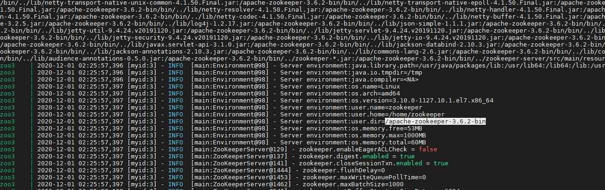

# zookeeper

zookeeper使用首先需要搭建部署

## zookeeper 安装

这里使用docker-compose 安装zookeeper集群

docker-compose.yml

```yaml
version: '3.1'

services:
  zoo1:
    image: zookeeper
    restart: always
    hostname: zoo1
    ports:
      - 2181:2181
    environment:
      ZOO_MY_ID: 1
      ZOO_SERVERS: server.1=0.0.0.0:2888:3888;2181 server.2=zoo2:2888:3888;2181 server.3=zoo3:2888:3888;2181

  zoo2:
    image: zookeeper
    restart: always
    hostname: zoo2
    ports:
      - 2182:2181
    environment:
      ZOO_MY_ID: 2
      ZOO_SERVERS: server.1=zoo1:2888:3888;2181 server.2=0.0.0.0:2888:3888;2181 server.3=zoo3:2888:3888;2181

  zoo3:
    image: zookeeper
    restart: always
    hostname: zoo3
    ports:
      - 2183:2181
    environment:
      ZOO_MY_ID: 3
      ZOO_SERVERS: server.1=zoo1:2888:3888;2181 server.2=zoo2:2888:3888;2181 server.3=0.0.0.0:2888:3888;2181
```

启动

```shell script
docker-compose -f -d docker-compose.yml up
```



> 注意这里的版本号 `3.6.2` ! 后面需要版本号一致

## 修改pom 

微服务 生产-消费
- spring-cloud-demo-provider-payment
- spring-cloud-demo-consumer-order

需要把其他的服务发现注册 注释掉 打开zookeeper 同时引入对应版本好的zoo keeper 客户端

```xml

        <!--zookeeper 作为 注册中心-->
         <dependency>
                      <groupId>org.springframework.cloud</groupId>
                      <artifactId>spring-cloud-starter-zookeeper-discovery</artifactId>
                      <exclusions>
                          <exclusion>
                              <groupId>org.apache.zookeeper</groupId>
                              <artifactId>zookeeper</artifactId>
                          </exclusion>
                      </exclusions>
                  </dependency>
                  <dependency>
                      <groupId>org.apache.zookeeper</groupId>
                      <artifactId>zookeeper</artifactId>
                      <version>3.4.6</version>
                  </dependency>

```
### 2. 修改yml文件

微服务生产者
- spring-cloud-demo-provider-payment

application-zookeeper.yml
```yaml

server:
  port: 8004

spring:
  application:
    name: cloud-payment-service
  datasource:
    # 当前数据源操作类型
    type: com.alibaba.druid.pool.DruidDataSource
    # mysql驱动类
    driver-class-name: com.mysql.jdbc.Driver
    url: jdbc:mysql://192.168.35.3:3306/springcloud-payment?useUnicode=true&characterEncoding=UTF-8&useSSL=false&serverTimezone=GMT%2B8
    username: root
    password: root
  jpa:
    hibernate:
      ddl-auto: update
    show-sql: true

# 单个就配置单独一个即可
  cloud:
    zookeeper:
      connect-string: 192.168.203.102:2181,192.168.203.102:2182,192.168.203.102:2183
```

- spring-cloud-demo-consumer-order

消费者 application-zookeeper.yml
```yaml
server:
  port: 80
spring:
  application:
    name: cloud-consumer-order
  # 单个就配置单独一个即可
  cloud:
    zookeeper:
      connect-string: 192.168.203.102:2181,192.168.203.102:2182,192.168.203.102:2183

```


### 3. 添加注解
1. 只需要在消费者-生产者的启动类上添加注解 `@EnableDiscoveryClient` 表明使用服务发现客户端即可启动
2. 设定profile zookeeper 启动支付和订单服务 

> 需要注意的是，在zookeeper中服务名都是小写的 所以如果用Eureka的大写的服务名会报错找不到


### 4. 测试访问

'http://localhost/consumer/payment/get/1' 

