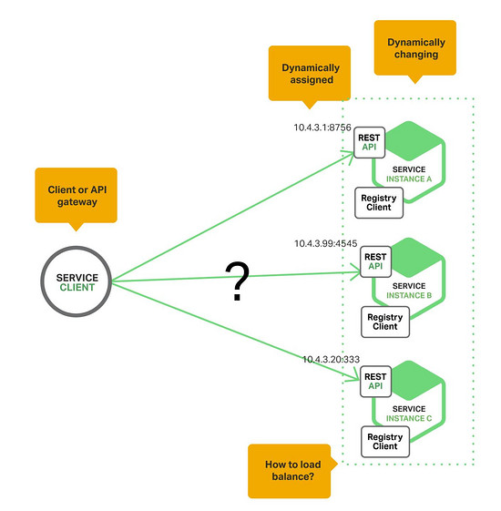
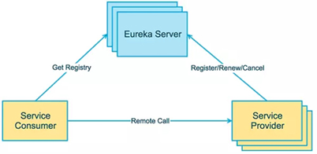

# 服务发现

## 1. 为什么使用服务发现（痛点）

每一服务实例都会在特定位置（主机与端口）通过HTTP/REST或者Thrift等方式发布一个远程API。

服务端实例的具体数量及位置会发生动态变化。

虚拟机与容器化部署通常会被分配动态IP地址。

服务实例的数量会发生动态变化。例如，EC自动伸缩组会根据负载情况随时调整实例数量。

## 2. 解决方案 Eureka

### 2.1 Eureka 

服务提供者：向注册中心发送请求，发送信息
      
服务消费者：向注册中心发送请求，获取信息
      
注册中心:
- 提供接口给服务发现客户端调用
- 维护服务实例信息集合
- 集群之间信息同步

> 附上讲解博客[https://www.cnblogs.com/roytian/p/12125478.html#_lab2_0_0](https://www.cnblogs.com/roytian/p/12125478.html#_lab2_0_0)

> [实际演示代码讲解>](service-discovery-eureka.md)

### 2.2 zookeeper

Zookeeper最早起源于雅虎研究院的一个研究小组。

在当时，研究人员发现，在雅虎内部很多大型系统基本都需要依赖一个类似的系统来进行分布式协调，
但是这些系统往往都存在分布式单点问题。

所以，雅虎的开发人员就试图开发一个通用的无单点问题的分布式协调框架，
以便让开发人员将精力集中在处理业务逻辑上。

ZooKeeper 是一个典型的分布式数据一致性解决方案，分布式应用程序可以基于 ZooKeeper 实现诸如数据发布/订阅、负载均衡、命名服务、分布式协调/通知、集群管理、Master 选举、分布式锁和分布式队列等功能。

ZooKeeper 的设计目标是将那些复杂且容易出错的分布式一致性服务封装起来，构成一个高效可靠的原语集，并以一系列简单易用的接口提供给用户使用。

> 附上详解参考[https://www.jianshu.com/p/3e35437d0a88](https://www.jianshu.com/p/3e35437d0a88)
>

Zookeeper 一个最常用的使用场景就是用于担任服务生产者和服务消费者的注册中心。 

> [实际演示代码讲解>](service-discovery-zookeeper.md)

### 2.3 consul

https://www.consul.io/intro Consul是一种服务网格解决方案，提供具有服务发现，配置和分段功能的全功能控制平面。这些功能中的每一个都可以根据需要单独使用，也可以一起使用以构建完整的服务网格。Consul需要一个数据平面，并支持代理和本机集成模型。Consul附带了一个简单的内置代理，因此一切都可以直接使用，还支持Envoy等第三方代理集成。

> [实际演示代码讲解>](service-discovery-consul.md)
>
>

