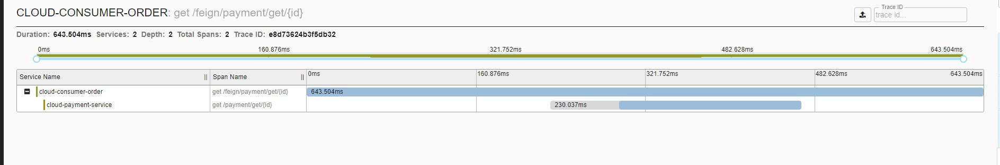

# sleuth 请求链路

搭配zipkin使用(这里的zipkin,提供了请求数据的存储和展示), 使用docker 运行启动

```shell script
docker run -p 9411:9411 openzipkin/zipkin:2.17.2
```

http://zipkin:9411/zipkin/

 
# 解决问题

随着业务的发展，单体架构变为微服务架构，并且系统规模也变得越来越大，各微服务间的**调用关系也变得越来越复杂**。

在微服务的应用中，一个由客户端发起的请求在后端系统中会**经过多个不同的微服务**调用来协同产生最后的请求结果

在复杂的微服务架构系统中，几乎每一个前端请求都会形成一个复杂的分布式服务调用链路，在每条链路中任何一个依赖服务出现延迟超时或者错误都有可能引起整个请求最后的失败


微服务跟踪(sleuth)其实是一个工具,它在整个分布式系统中能跟踪一个用户请求的过程(包括数据采集，数据传输，数据存储，数据分析，数据可视化)，捕获这些跟踪数据，就能构建微服务的整个调用链的视图，这是调试和监控微服务的关键工具。

# SpringCloudSleuth功能特点

1. 提供链路追踪	
2. 性能分析	
3. 数据分析,优化链路	
4. 可视化

# 实际编码

这里举例:
- spring-cloud-demo-provider-payment
- spring-cloud-demo-consumer-order

## 1. 引入pom

在微服务(需要记录的都要引入,**可以考虑放入公共模块**)中引入pom

```xml
   <!--包含了sleuth+zipkin-->
        <dependency>
            <groupId>org.springframework.cloud</groupId>
            <artifactId>spring-cloud-starter-zipkin</artifactId>
        </dependency>

```

## 2. 修改yml

配置微服务把请求数据发到zipkin

```yaml
spring:
    # zipkin+sleuth 请求链路监控
  zipkin:
    base-url: http://zipkin:9411
  sleuth:
    sampler:
      #采样率值介于 0 到 1 之间，1 则表示全部采集
      probability: 1
```

## 3. 访问测试

1. 通过 访问 `spring-cloud-demo-consumer-order` 调用`spring-cloud-demo-provider-payment` 
2. 然后观察zipkin

3. 左上角筛选服务名等信息,然后点击搜索图标

4. 可以看到一个服务请求列表(我这里就请求了一次),然后找一个点击进去
> 类似这种的,说明是查看这次的trace id 的详情 `http://zipkin:9411/zipkin/traces/e8d73624b3f5db32`


可以看到该次请求的耗时:包括总用时,调用深度,调用哪个服务端,路径,服务端耗时

