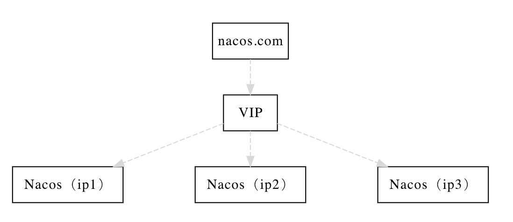

#  Nacos

（Nacos）Dynamic Naming and Configuration Service 动态命名和配置服务 
一个更易于构建云原生应用的动态服务发现、配置管理和服务管理平台。
- [https://nacos.io/zh-cn/docs/what-is-nacos.html](https://nacos.io/zh-cn/docs/what-is-nacos.html)

>  简单来说 ：Nacos = Eureka+Config+Bus 注册中心与配置中心的组合


# 1. 搭建单机 nacos

> [https://nacos.io/zh-cn/docs/quick-start-docker.html](https://nacos.io/zh-cn/docs/quick-start-docker.html)
>

我这里选的是单机版本Derby 省得去配置数据库
> 需要下载配置好 `docker` `docker-compose`

```shell script
git clone https://github.com/nacos-group/nacos-docker.git
cd nacos-docker
docker-compose -f example/standalone-derby.yaml up -d
```

启动完成之后可以访问 : [http://nacos:8848/nacos/](http://nacos:8848/nacos/) , 账号/密码: `nacos`

> 这样访问需要你自己配置hosts 去把nacos 指向你的虚拟机IP

# 2.nacos服务发现 演示

## 2.1 服务注册发现-服务端和客户端加入pom

这里就直接改造`spring-cloud-demo-provider-payment` 和 `spring-cloud-demo-consumer-order` ,把之前的配置中心注释掉，添加nacos

```xml
        <!--微服务nacos 服务发现 选一 -->
        <dependency>
            <groupId>com.alibaba.cloud</groupId>
            <artifactId>spring-cloud-starter-alibaba-nacos-discovery</artifactId>
        </dependency>
```


## 2.2 服务提供(spring-cloud-demo-provider-payment)配置yml(application-nacos.yml)

```yaml

spring:
  application:
    name: nacos-payment-service
  cloud:
    nacos:
      discovery:
        #Nacos服务注册中心地址
        server-addr: nacos:8848
## 
management:
  endpoints:
    web:
      exposure:
        include: '*'

```

## 2.3 然后只需要配置注解`@EnableDiscoveryClient`

这一步就完成了服务提供者的注解，选中profile 启动即可

## 2.4 然后告诉消费者`spring-cloud-demo-consumer-order` 去nacos获取服务

1. 和上面一致加入pom
2. 修改yml表明nacos地址
```yaml
spring:
  cloud:
    nacos:
      discovery:
        server-addr: nacos:8848
  application:
    name: cloud-consumer-order
```
3. 加入启动类注解`@EnableDiscoveryClient`

4. 业务类 

指定nacos的服务提供者名字即可自动寻址，这点和eureka一样

```java
package top.freshgeek.springcloud.order.controller;

import org.springframework.beans.factory.annotation.Value;
import org.springframework.web.bind.annotation.*;
import org.springframework.web.client.RestTemplate;
import top.freshgeek.springcloud.common.dto.CommonResult;
import top.freshgeek.springcloud.payment.entity.Payment;

import javax.annotation.Resource;

/**
 * @author chen.chao
 */
@RequestMapping("/nacos/")
@RestController
public class OrderNacosController {

	final String service = "http://nacos-payment-service";

	@Resource
	private RestTemplate restTemplate;


	@GetMapping("payment/get/{id}")
	public CommonResult getPayment(@PathVariable("id") int id) {
		return restTemplate.getForObject(service + "/payment/get/" + id, CommonResult.class);
	}

	@PostMapping("payment/create")
	public CommonResult getPayment(Payment payment) {
		return restTemplate.postForObject(service + "/payment/create",
				payment, CommonResult.class);
	}

}

```

## 2.5 负载均衡
可以自动集成ribbon负载均衡，与之前的eureka方式一致


## 2.6 特性
nacos 支持CAP 理论中的 AP+CP 两者可以根据实际需求切换，不能同时支持


# 3. nacos配置中心 演示

等同于nacos 作为原本的`spring-cloud-demo-spring-config` 配置中心，
客户端使用直接连nacos,方式和理念都差不多，只不过nacos 消除了bus总线并天生集成了自动通知

## 3.1 使用配置

创建模块 spring-cloud-demo-nacos-config 

### 3.1.1 引入pom

```xml
        <!--nacos-config-->
        <dependency>
            <groupId>com.alibaba.cloud</groupId>
            <artifactId>spring-cloud-starter-alibaba-nacos-config</artifactId>
        </dependency>
        <!--nacos-discovery-->
        <dependency>
            <groupId>com.alibaba.cloud</groupId>
            <artifactId>spring-cloud-starter-alibaba-nacos-discovery</artifactId>
        </dependency>
        <!--web + actuator-->
        <dependency>
            <groupId>org.springframework.boot</groupId>
            <artifactId>spring-boot-starter-web</artifactId>
        </dependency>
        <dependency>
            <groupId>org.springframework.boot</groupId>
            <artifactId>spring-boot-starter-actuator</artifactId>
        </dependency>
        <!--一般基础配置-->
        <dependency>
            <groupId>org.springframework.boot</groupId>
            <artifactId>spring-boot-devtools</artifactId>
            <scope>runtime</scope>
            <optional>true</optional>
        </dependency>
        <dependency>
            <groupId>org.projectlombok</groupId>
            <artifactId>lombok</artifactId>
            <optional>true</optional>
        </dependency>
        <dependency>
            <groupId>org.springframework.boot</groupId>
            <artifactId>spring-boot-starter-test</artifactId>
            <scope>test</scope>
        </dependency>


```

### 3.1.2 写配置文件
一般开发场景都是把配置文件中心化，统一由配置中心配置，应用读取后再启动，因此这里也是使用 `bootstrap.yml`


```yaml

# nacos配置
spring:
  profile:
    active: dev
  application:
    name: nacos-config-client
  cloud:
    nacos:
      discovery:
        server-addr: nacos:8848 #Nacos服务注册中心地址
      config:
        server-addr: nacos:8848 #Nacos作为配置中心地址
        file-extension: yaml #指定yaml格式的配置
# ${spring.application.name}-${spring.profile.active}.${spring.cloud.nacos.config.file-extension}
# nacos-config-client-dev.yaml


```
 
> 这里需要配置一下nacos文件nacos-config-client-dev.yaml
>

 
```yaml
server:
    port:3377
config:
    info: 1234
```


### 3.1.3 加上启动类注解`@EnableDiscoveryClient`后一样写个key controller

```java

package top.freshgeek.springcloud.nacos.config.controller;

import org.springframework.beans.factory.annotation.Value;
import org.springframework.cloud.context.config.annotation.RefreshScope;
import org.springframework.web.bind.annotation.GetMapping;
import org.springframework.web.bind.annotation.RestController;

/**
 * @author chen.chao
 */
@RefreshScope
@RestController
public class ConfigController {
	@Value("${config.info}")
	private String configInfo;

	@GetMapping("/configInfo")
	public String getConfigInfo() {
		return configInfo;
	}
}

```

### 3.1.4 访问路径获取配置，然后修改nacos，测试发布


### 3.1.5 再次访问路径，可以看到已经刷新了,这样就完成了配置动态刷新

> 但是其实这里还有点不足，这边 nacos 不能提供灰度发布，和权限控制没有Apollo 强

## 4. nacos 配置分空间，分组
> [相关概念 https://nacos.io/zh-cn/docs/concepts.html](https://nacos.io/zh-cn/docs/concepts.html)

nacos 中有命名空间,默认是public，可以创建其他空间

> 官方介绍： 用于进行租户粒度的配置隔离。不同的命名空间下，可以存在相同的 Group 或 Data ID 的配置。Namespace 的常用场景之一是不同环境的配置的区分隔离，例如开发测试环境和生产环境的资源（如配置、服务）隔离等。                                


还有分组的概念，默认是DEFAULT_GROUP，也可以指定创建其他空间
> 


## 5. 接着两个问题
1. 如果Nacos挂掉怎么办
2. Nacos停机了，但是有些数据仍需要保留

### 5.1 配置持久化

配置信息一般是比较多的，并且可能nacos出现故障启动之后不能让配置信息消失，因此需要加入持久化
官方推荐的是MySQL ，并且最少需要主从备份,这里就直接连个单机MySQL


```shell script
docker run -d \
-e MODE=standalone \
-e SPRING_DATASOURCE_PLATFORM=mysql \
-e MYSQL_SERVICE_HOST=data.keepon.show \
-e MYSQL_SERVICE_PORT=3306 \
-e MYSQL_SERVICE_USER=springcloud \
-e MYSQL_SERVICE_PASSWORD=springcloud \
-e MYSQL_SERVICE_DB_NAME=nacos_db \
-p 8848:8848 \
--restart=always \
--name nacos-standalone-mysql-docker \
nacos/nacos-server:1.4.0
```

> 附上初始化脚本：[nacos-mysql.sql](https://github.com/alibaba/nacos/blob/master/distribution/conf/nacos-mysql.sql)
> 具体配置文档属性说明：[https://nacos.io/zh-cn/docs/quick-start-docker.html](https://nacos.io/zh-cn/docs/quick-start-docker.html)
> 主从备份搭建可以看我的博文[MySQL 主从复制搭建 一主一从环境搭建](https://blog.csdn.net/qq_35530042/article/details/107437484)

官方docker-compose 的版本只能连docker自动创建的mysql，我也贴一下

```shell script
git clone https://github.com/nacos-group/nacos-docker.git
cd nacos-docker
docker-compose -f example/standalone-mysql-5.7.yaml up
```

可以在配置中心添加一个配置，然后在数据库中查看已经出现了这一条记录，我的版本是在 `config_info` 这个表


这样，如果应用挂了，就重启后就直接从mysql 中读取配置信息了，这样稳定性就增强了很多，基本上很多中小厂就完全够用了

## 5.2 Nacos消除单点故障，集群部署

虽然加了MySQL,但是还存在单点故障，因为虽然我们的nacos 集成了配置中心+服务发现，
但是带来的问题就是不能挂，如果注册服务发现挂了，整个微服务就瘫痪了 ， 因此集群部署也是必须做的

> [https://nacos.io/zh-cn/docs/cluster-mode-quick-start.html](https://nacos.io/zh-cn/docs/cluster-mode-quick-start.html)

### 5.2.1 官方docker-compose

这里直接用docker-compose 构建一下

```shell script

git clone https://github.com/nacos-group/nacos-docker.git
cd nacos-docker
docker-compose -f example/cluster-hostname.yaml up 

```

### 5.2.2 官方多机器部署
-[https://nacos.io/zh-cn/docs/cluster-mode-quick-start.html](https://nacos.io/zh-cn/docs/cluster-mode-quick-start.html)



这边VIP其实就是就是一个负载均衡,然后我们这些nacos 节点由VIP 负载均衡,然后配置一个域名指向VIP的IP,这样可读性好,且更换IP方便,官方推荐

生产环境nacos后面应该连入 高可用db  我们这里还是使用前面的MySQL单机 (正常应该是主备模式MySQL)

我们这里用一个虚拟机模拟四个机器,VIP+三个nacos

```shell script

# 创建日志挂载路径/ 
mkdir -p  /home/docker-data/nacos-cluster/log1 /home/docker-data/nacos-cluster/log2 /home/docker-data/nacos-cluster/log3


docker run -d \
-e MODE=cluster \
-e NACOS_SERVERS="172.17.0.2:8848 172.17.0.3:8848 172.17.0.4:8848" \
-e SPRING_DATASOURCE_PLATFORM=mysql \
-e MYSQL_SERVICE_HOST=data.keepon.show \
-e MYSQL_SERVICE_PORT=3306 \
-e MYSQL_SERVICE_USER=springcloud \
-e MYSQL_SERVICE_PASSWORD=springcloud \
-e MYSQL_SERVICE_DB_NAME=nacos_db \
-e JVM_XMS=256m -e JVM_XMX=512m  -e JVM_XMN=256m \
-v /home/docker-data/nacos-cluster/log1:/home/nacos/logs \
-p 18848:8848 -p 17848:7848 \
--restart=always \
--name nacos-01 \
nacos/nacos-server:1.4.0

docker run -d \
-e MODE=cluster \
-e NACOS_SERVERS="172.17.0.2:8848 172.17.0.3:8848 172.17.0.4:8848" \
-e SPRING_DATASOURCE_PLATFORM=mysql \
-e MYSQL_SERVICE_HOST=data.keepon.show \
-e MYSQL_SERVICE_PORT=3306 \
-e MYSQL_SERVICE_USER=springcloud \
-e MYSQL_SERVICE_PASSWORD=springcloud \
-e MYSQL_SERVICE_DB_NAME=nacos_db \
-e JVM_XMS=256m -e JVM_XMX=512m  \
-v /home/docker-data/nacos-cluster/log2:/home/nacos/logs \
-p 28848:8848 -p 27848:7848 \
--restart=always \
--name nacos-02 \
nacos/nacos-server:1.4.0

docker run -d \
-e MODE=cluster \
-e NACOS_SERVERS="172.17.0.2:8848 172.17.0.3:8848 172.17.0.4:8848" \
-e SPRING_DATASOURCE_PLATFORM=mysql \
-e MYSQL_SERVICE_HOST=data.keepon.show \
-e MYSQL_SERVICE_PORT=3306 \
-e MYSQL_SERVICE_USER=springcloud \
-e MYSQL_SERVICE_PASSWORD=springcloud \
-e MYSQL_SERVICE_DB_NAME=nacos_db \
-e JVM_XMS=256m -e JVM_XMX=512m  \
-v /home/docker-data/nacos-cluster/log3:/home/nacos/logs \
-p 38848:8848 -p 37848:7848 \
--restart=always \
--name nacos-03 \
nacos/nacos-server:1.4.0

```

> -e NACOS_SERVERS="172.17.0.2:8848 172.17.0.3:8848 172.17.0.4:8848" \

这里的地址因为我是在一台机器上面 所以这个地址是docker 的内网地址 通过 ` docker inspect nacos-01 ` 这样看到的

注意：默认使用端口为8848（nacos对外提供服务）和 7848（用于nacos集群通信，进行选举，检测等等），
所以防火墙一定要开启这两个端口，不能只开放8848，否则会导致无法启动集群

最终情况是有三个节点up , 如果网络没配对可能出现4个节点,其实是错误的,应用程序会连不上


```shell script
docker pull nginx:1.19.6

## 我们还需要提供一下默认的nginx 配置
docker run -d --name tmp-nginx nginx:1.19.6 ;
docker cp tmp-nginx:/etc/nginx/ /home/data/docker/
docker rm -f tmp-nginx

## 然后可以看到我们这边有了默认的配置
## 如果还需要弄其他的一些 日志 缓存等目录 加数据卷映射就好了
## 然后我们运行nginx 
docker run \
-d --name nginx \
-v /home/data/docker/nginx:/etc/nginx \
-p 80:80 \
nginx:1.19.6
## 这个时候访问IP 应该能看到nginx 界面
## 先备份一下
cp /home/data/docker/nginx/conf.d/default.conf /home/data/docker/nginx/conf.d/default.conf.bk
vi /home/data/docker/nginx/conf.d/default.conf
## 把下面的复制进对应的body 然后:wq 保存
docker restart nginx

```

```text
upstream nacos {
        server 192.168.203.102:18848;
        server 192.168.203.102:18849;
        server 192.168.203.102:18850;
}
server {
    listen       80;
    listen  [::]:80;
    server_name  localhost;
 
    location  / {
        proxy_pass   http://nacos;
    }
 
}
 
```


这个时候输入 `http://nacos/nacos/` 应该就是集群地址了,这样我们就完成了ngix+ 3 nacos + db 部署了

同时可以使用启动配置 nacos-cluster-productor-consumer  测试能否成功


