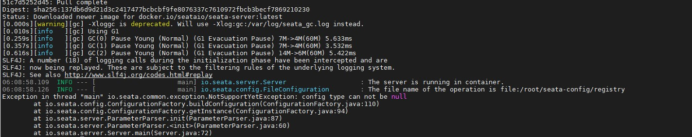
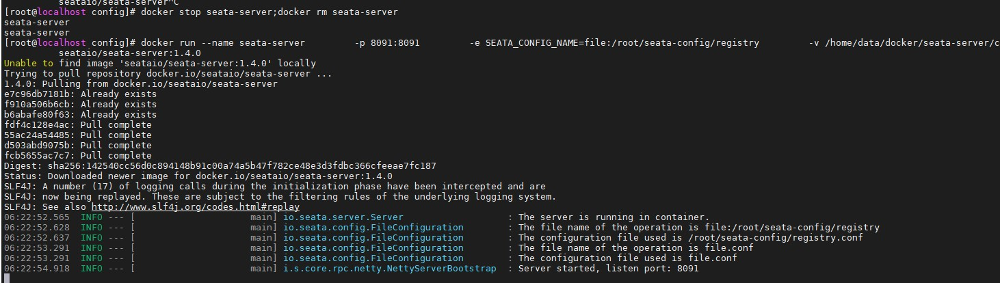

# Seata 介绍

2019 年 1 月，阿里巴巴中间件团队发起了开源项目 Fescar（Fast & EaSy Commit And Rollback），和社区一起共建开源分布式事务解决方案。Fescar 的愿景是让分布式事务的使用像本地事务的使用一样，简单和高效，并逐步解决开发者们遇到的分布式事务方面的所有难题。

Fescar 开源后，蚂蚁金服加入 Fescar 社区参与共建，并在 Fescar 0.4.0 版本中贡献了 TCC 模式。

为了打造更中立、更开放、生态更加丰富的分布式事务开源社区，经过社区核心成员的投票，大家决定对 Fescar 进行品牌升级，
并更名为 Seata，意为：Simple Extensible Autonomous Transaction Architecture，是一套一站式分布式事务解决方案。

## 简述痛点

随着微服务的增多，一个业务可能不单单依赖于一个微服务，可能是多个微服务调用组成，而我们通过http调用并没有保证这个业务的事务完整性
而全局事务引入，目的就是为了解决微服务调用间的这种情况


**附:官网地址**
- https://github.com/seata/seata
- https://seata.io/zh-cn/index.html 

## 搭建部署Seata

我们这里采用指定文件的方式docker 部署入门 , 后面我们再部署一个外部数据源版本
 
- 我这里把 `/home/data/docker/seata-server/config` 作为挂载配置目录

```shell script

mkdir -p /home/data/docker/seata-server/config
docker run -d --name seata-server \
        -p 8091:8091 \
        -e SEATA_IP=192.168.35.16 \
        -e SEATA_CONFIG_NAME=file:/root/seata-config/registry \
        -v /home/data/docker/seata-server/config:/root/seata-config  \
        --privileged=true \
        seataio/seata-server:1.4.0
```
ip 绑定你客户端能访问到seata的IP



- 这边他不会自动生成文件,官网docker部署文档也没有文件示例,
我在 `https://github.com/seata/seata/tree/1.4.0/script/server/config` 下是默认的配置文件

```shell script
cd /home/data/docker/seata-server/config
wget https://raw.githubusercontent.com/seata/seata/1.4.0/script/server/config/registry.conf
wget https://raw.githubusercontent.com/seata/seata/1.4.0/script/server/config/file.conf
```

当然不同版本切换一下对应的分支,我这里使用的是1.4.0 


这里简单分析一下配置文件,主要配置了两个东西:
- registry 注册中心分别可以指指定`file,nacos,eureka,redis,zk,consul,etcd3,sofa`
- config  配置中心分别可以指指定`file、nacos 、apollo、zk、consul、etcd3`

**注意**:我们这里要把注册中心,配置中心 都换成nacos,seata 也交给seata管理


- 解决“/bin/bash^M: bad interpreter
> 在执行shell脚本时提示这样的错误主要是由于shell脚本文件是dos格式，即每一行结尾以\r\n来标识，而unix格式的文件行尾则以\n来标识

- io.seata.common.exception.FrameworkException: can not connect to services-server.
```text
2020-12-13 23:23:22.966 ERROR [seata-storage-service,,,] 13836 --- [eoutChecker_2_1] i.s.c.r.netty.NettyClientChannelManager  : 0304 register RM failed.

io.seata.common.exception.FrameworkException: can not connect to services-server.
	at io.seata.core.rpc.netty.NettyClientBootstrap.getNewChannel(NettyClientBootstrap.java:182) ~[seata-all-1.4.0.jar:1.4.0]
	at io.seata.core.rpc.netty.NettyPoolableFactory.makeObject(NettyPoolableFactory.java:58) ~[seata-all-1.4.0.jar:1.4.0]
	at io.seata.core.rpc.netty.NettyPoolableFactory.makeObject(NettyPoolableFactory.java:34) ~[seata-all-1.4.0.jar:1.4.0]
	at org.apache.commons.pool.impl.GenericKeyedObjectPool.borrowObject(GenericKeyedObjectPool.java:1220) ~[commons-pool-1.6.jar:1.6]
	at io.seata.core.rpc.netty.NettyClientChannelManager.doConnect(NettyClientChannelManager.java:221) [seata-all-1.4.0.jar:1.4.0]
	at io.seata.core.rpc.netty.NettyClientChannelManager.acquireChannel(NettyClientChannelManager.java:107) [seata-all-1.4.0.jar:1.4.0]
	at io.seata.core.rpc.netty.NettyClientChannelManager.reconnect(NettyClientChannelManager.java:189) [seata-all-1.4.0.jar:1.4.0]
	at io.seata.core.rpc.netty.AbstractNettyRemotingClient$1.run(AbstractNettyRemotingClient.java:114) [seata-all-1.4.0.jar:1.4.0]
	at java.util.concurrent.Executors$RunnableAdapter.call(Executors.java:511) [na:1.8.0_221]
	at java.util.concurrent.FutureTask.runAndReset$$$capture(FutureTask.java:308) [na:1.8.0_221]
	at java.util.concurrent.FutureTask.runAndReset(FutureTask.java) [na:1.8.0_221]
	at java.util.concurrent.ScheduledThreadPoolExecutor$ScheduledFutureTask.access$301(ScheduledThreadPoolExecutor.java:180) [na:1.8.0_221]
	at java.util.concurrent.ScheduledThreadPoolExecutor$ScheduledFutureTask.run(ScheduledThreadPoolExecutor.java:294) [na:1.8.0_221]
	at java.util.concurrent.ThreadPoolExecutor.runWorker(ThreadPoolExecutor.java:1149) [na:1.8.0_221]
	at java.util.concurrent.ThreadPoolExecutor$Worker.run(ThreadPoolExecutor.java:624) [na:1.8.0_221]
	at io.netty.util.concurrent.FastThreadLocalRunnable.run(FastThreadLocalRunnable.java:30) [netty-all-4.1.43.Final.jar:4.1.43.Final]
	at java.lang.Thread.run(Thread.java:748) [na:1.8.0_221]
Caused by: io.seata.common.exception.FrameworkException: connect failed, can not connect to services-server.
	at io.seata.core.rpc.netty.NettyClientBootstrap.getNewChannel(NettyClientBootstrap.java:177) ~[seata-all-1.4.0.jar:1.4.0]
	... 16 common frames omitted

```
> 如果配置在云服务器，这个seata_ip一定要写，本地可以不写。不然注册到nacos里面的是容器的本地ip，那样的话，就不能ping通，因此客户端就无法访问到seata。
  
sed -i "s/\r//" filename

然后接着就是每个对应的连接信息

后面我们把seata集成入nacos 完成全家桶


## 成功搭建之后我们开始写代码

我们这里创建新的三个微服务,同时把公有实体抽取到公共模块,模拟真实开发场景,同时使用spring cloud alibaba 来完成三个微服务整合

- spring-cloud-demo-seata-account-service 
- spring-cloud-demo-seata-order-service
- spring-cloud-demo-seata-storage-service


### 1.创建模块,引入pom

这里太多了就不全贴出来了,可以直接在项目模块中看,这里需要注意的就是seata版本要与server 版本一致,我这里是1.4.0并且在父工程spring-cloud-demo中指定了版本

```xml
    <!--seata 全局事务管理-->
        <dependency>
            <groupId>com.alibaba.cloud</groupId>
            <artifactId>spring-cloud-starter-alibaba-seata</artifactId>
        </dependency>
```

### 2.


