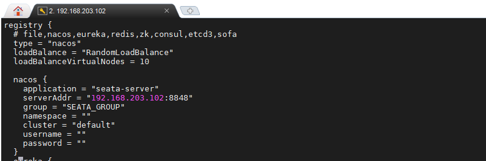
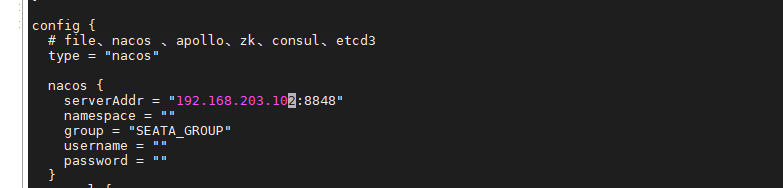
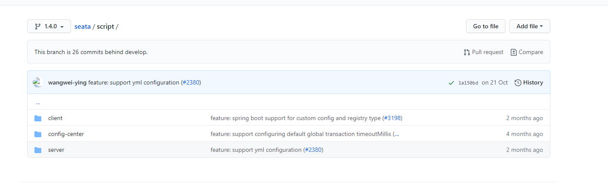

# Seata 介绍

2019 年 1 月，阿里巴巴中间件团队发起了开源项目 Fescar（Fast & EaSy Commit And Rollback），和社区一起共建开源分布式事务解决方案。Fescar 的愿景是让分布式事务的使用像本地事务的使用一样，简单和高效，并逐步解决开发者们遇到的分布式事务方面的所有难题。

Fescar 开源后，蚂蚁金服加入 Fescar 社区参与共建，并在 Fescar 0.4.0 版本中贡献了 TCC 模式。

为了打造更中立、更开放、生态更加丰富的分布式事务开源社区，经过社区核心成员的投票，大家决定对 Fescar 进行品牌升级，
并更名为 Seata，意为：Simple Extensible Autonomous Transaction Architecture，是一套一站式分布式事务解决方案。

## 简述痛点

随着微服务的增多，一个业务可能不单单依赖于一个微服务，可能是多个微服务调用组成，而我们通过http调用并没有保证这个业务的事务完整性，
而全局事务引入，目的就是为了解决微服务调用间的这种情况


**附:官网地址**

- https://github.com/seata/seata
- https://seata.io/zh-cn/index.html 

## 搭建部署Seata

### 基础知识

我们这里采用指定文件的方式docker 部署入门 , 后面我们再部署一个外部数据源版本
 
- 我这里把 `/home/data/docker/seata-server/config` 作为挂载配置目录，这样我们就能在容器外面修改配置

```shell script

mkdir -p /home/data/docker/seata-server/config
docker run -d --name seata-server \
        -p 8091:8091 \
        -e SEATA_IP=192.168.203.102 \
        -e SEATA_CONFIG_NAME=file:/root/seata-config/registry \
        -v /home/data/docker/seata-server/config:/root/seata-config  \
        --privileged=true \
        seataio/seata-server:1.4.0
```

**SEATA_IP 绑定你客户端能访问到seata的IP**


注意：这边他不会自动生成文件,官网docker部署文档也没有文件示例，查了之后发现在[新手文档](https://seata.io/zh-cn/docs/ops/deploy-guide-beginner.html) 中介绍了配置文件在哪

然后在 `https://github.com/seata/seata/tree/1.4.0/script/server/config` 下是 `服务端的默认配置文件`


- 客户端 也要配置文件
- 如果接入配置中心也需要导入配置到配置中心

> 不过这两部分我们后面再介绍 ， 先弄服务端


```shell script
# 进入到我们前面的挂在目录
cd /home/data/docker/seata-server/config
# 把对应版本的配置文件模板下载下来
wget https://raw.githubusercontent.com/seata/seata/1.4.0/script/server/config/registry.conf
wget https://raw.githubusercontent.com/seata/seata/1.4.0/script/server/config/file.conf

```

直接启动，这里我们就是启动了普通的文件作为注册中心，文件作为配置中心 

当然不同版本切换一下对应的分支,我这里使用的是1.4.0 


### 分析配置文件

这里简单分析一下配置文件,主要配置了两个东西:

- registry 注册中心分别可以指指定`file,nacos,eureka,redis,zk,consul,etcd3,sofa`
- config  配置中心分别可以指指定`file、nacos 、apollo、zk、consul、etcd3`

### 修改为 nacos作为注册中心和配置中心 

我们这里要把注册中心,配置中心 都换成nacos,seata 也交给seata管理

> **注意**:  自己的nacos IP 换成自己的

**注册中心修改为nacos**



**配置中心修改为nacos**



### nacos 配置从哪里来

我们把seata的配置中心放在nacos,但是我们nacos 里面啥也没配置,那么初始化的配置从哪来?

前面提到了配置中心需要导入配置

- https://github.com/seata/seata/tree/1.4.0/script

我们服务端配置在server目录下,配置中心的在 [config-center 1.4.0 版本的地址 https://github.com/seata/seata/tree/1.4.0/script/config-center](https://github.com/seata/seata/tree/1.4.0/script/config-center) 下 



里面有不同种配置中心的配置导入脚本， 我们这里选择nacos 生态嘛  那就选择nacos的

1.首先，clone git

如果慢,也可以找到gitee 上面的 , 注意切换分支就行

```shell script
mkdir -p /home/data/docker/seata-server/git-seata
cd /home/data/docker/seata-server/git-seata
git clone https://github.com/seata/seata.git
git checkout 1.4.0 

```
2. 替换执行


**SEATAPATH 这个变量是对应的seata 路径要替换的**

下面两个分情况执行

```shell script


# 如果指定nacos 的一些参数：nacos地址 端口 分组 命名空间 用户名 密码
 
sh ${SEATAPATH}/script/config-center/nacos/nacos-config.sh -h localhost -p 8848 -g SEATA_GROUP -t 5a3c7d6c-f497-4d68-a71a-2e5e3340b3ca -u username -w password

#  默认nacos就是在本机，然后端口8848 SEATA_GROUP 分组 默认public 没有用户名密码
sh ${SEATAPATH}/script/config-center/nacos/nacos-config.sh 

```

完成之后,可以在nacos 中看到这些配置

3. 存储到mysql

上面，我们连到了nacos配置导入了，那我们要修改把seata的运行事务那些信息存储到mysql，需要在nacos 中修改这些项：

1. store.mode 改为 db
2. store.db.url 改为自己的地址
3. store.db.user 用户名
4. store.db.password 密码

改了之后需要在自己对应的数据库中导入数据库脚本

- [https://github.com/seata/seata/blob/1.4.0/script/server/db/mysql.sql](https://github.com/seata/seata/blob/1.4.0/script/server/db/mysql.sql)


其他的一些连接信息也可以自己调整,再重启

> 也可以选择存在别处，官方文档上面也有对比各种情况的优劣，注：
>
> file模式为单机模式，全局事务会话信息内存中读写并持久化本地文件root.data，性能较高;
>
> db模式为高可用模式，全局事务会话信息通过db共享，相应性能差些;
>
> redis模式Seata-Server 1.3及以上版本支持,性能较高,存在事务信息丢失风险,请提前配置合适当前场景的redis持久化配置.


### 导入配置中心原理

**Seata-server 也是一个微服务应用,需要配置中心和注册中心**,前面配置的文件 `registry.conf` 就是指定了配置中心和注册中心的地址

- 注册中心就是服务发现和注册嘛,然后后面需要seata全局事务管理的微服务客户端可以找到seata

- 配置中心就是一些seata-server 运行需要的配置项存放和值,和开始file.conf一样

其中重要的一个k-v 是 `service.vgroupMapping.my_test_tx_group=default`  , 这个指定了一个微服务的事务分组，这里特别坑，后面客户端我们用到暂时先不动它

其中我配置过程中遇到的两个坑,贴一下:

- 解决“/bin/bash^M: bad interpreter
> 在执行shell脚本时提示这样的错误主要是由于shell脚本文件是dos格式，即每一行结尾以\r\n来标识，而unix格式的文件行尾则以\n来标识
> 使用 sed -i "s/\r//" filename
>

- io.seata.common.exception.FrameworkException: can not connect to services-server.

```text

2020-12-13 23:23:22.966 ERROR [seata-storage-service,,,] 13836 --- [eoutChecker_2_1] i.s.c.r.netty.NettyClientChannelManager  : 0304 register RM failed.

io.seata.common.exception.FrameworkException: can not connect to services-server.
	at io.seata.core.rpc.netty.NettyClientBootstrap.getNewChannel(NettyClientBootstrap.java:182) ~[seata-all-1.4.0.jar:1.4.0]
	at io.seata.core.rpc.netty.NettyPoolableFactory.makeObject(NettyPoolableFactory.java:58) ~[seata-all-1.4.0.jar:1.4.0]
	at io.seata.core.rpc.netty.NettyPoolableFactory.makeObject(NettyPoolableFactory.java:34) ~[seata-all-1.4.0.jar:1.4.0]
	at org.apache.commons.pool.impl.GenericKeyedObjectPool.borrowObject(GenericKeyedObjectPool.java:1220) ~[commons-pool-1.6.jar:1.6]
	at io.seata.core.rpc.netty.NettyClientChannelManager.doConnect(NettyClientChannelManager.java:221) [seata-all-1.4.0.jar:1.4.0]
	at io.seata.core.rpc.netty.NettyClientChannelManager.acquireChannel(NettyClientChannelManager.java:107) [seata-all-1.4.0.jar:1.4.0]
	at io.seata.core.rpc.netty.NettyClientChannelManager.reconnect(NettyClientChannelManager.java:189) [seata-all-1.4.0.jar:1.4.0]
	at io.seata.core.rpc.netty.AbstractNettyRemotingClient$1.run(AbstractNettyRemotingClient.java:114) [seata-all-1.4.0.jar:1.4.0]
	at java.util.concurrent.Executors$RunnableAdapter.call(Executors.java:511) [na:1.8.0_221]
	at java.util.concurrent.FutureTask.runAndReset$$$capture(FutureTask.java:308) [na:1.8.0_221]
	at java.util.concurrent.FutureTask.runAndReset(FutureTask.java) [na:1.8.0_221]
	at java.util.concurrent.ScheduledThreadPoolExecutor$ScheduledFutureTask.access$301(ScheduledThreadPoolExecutor.java:180) [na:1.8.0_221]
	at java.util.concurrent.ScheduledThreadPoolExecutor$ScheduledFutureTask.run(ScheduledThreadPoolExecutor.java:294) [na:1.8.0_221]
	at java.util.concurrent.ThreadPoolExecutor.runWorker(ThreadPoolExecutor.java:1149) [na:1.8.0_221]
	at java.util.concurrent.ThreadPoolExecutor$Worker.run(ThreadPoolExecutor.java:624) [na:1.8.0_221]
	at io.netty.util.concurrent.FastThreadLocalRunnable.run(FastThreadLocalRunnable.java:30) [netty-all-4.1.43.Final.jar:4.1.43.Final]
	at java.lang.Thread.run(Thread.java:748) [na:1.8.0_221]
Caused by: io.seata.common.exception.FrameworkException: connect failed, can not connect to services-server.
	at io.seata.core.rpc.netty.NettyClientBootstrap.getNewChannel(NettyClientBootstrap.java:177) ~[seata-all-1.4.0.jar:1.4.0]
	... 16 common frames omitted

```


> 如果配置在云服务器，这个seata_ip一定要写，本地可以不写。不然注册到nacos里面的是容器的本地ip，那样的话，就不能ping通，因此客户端就无法访问到seata。


## 成功搭建之后我们开始写代码

我们这里创建新的三个微服务,同时把公有实体抽取到公共模块,模拟真实开发场景,同时使用spring cloud alibaba 来完成三个微服务整合

- spring-cloud-demo-seata-account-service 
- spring-cloud-demo-seata-order-service
- spring-cloud-demo-seata-storage-service


### 1.创建模块,引入pom

这里太多了就不全贴出来了,可以直接在项目模块中看,这里需要注意的就是`seata版本要与server 版本一致`,我这里是1.4.0 , 在父工程spring-cloud-demo中指定了版本,所以直接引入就好了

```xml
    <!--seata 全局事务管理-->
        <dependency>
            <groupId>com.alibaba.cloud</groupId>
            <artifactId>spring-cloud-starter-alibaba-seata</artifactId>
        </dependency>
```

### 2. 写配置类

三个都是差不多的我就直接介绍一个spring-cloud-demo-seata-account-service了

- 首先是引导配置 `bootstrap.yml`

```yaml

spring:
  profiles:
    active: dev
  application:
    name: seata-account-service
  cloud:
    nacos:
      discovery:
        server-addr: nacos:8848 #Nacos服务注册中心地址
      config:
        server-addr: nacos:8848 #Nacos作为配置中心地址
        file-extension: yaml #指定yaml格式的配置
        # 几个微服务都用同一个库，所以都加了统一的jpa连接 和 zipkin 前面的路径跟踪
        ext-config:
          - data‐id: common-datasource-jpa.yaml
            group: COMMON_GROUP
            refresh: true
          - data‐id: sluth-zipkin.yaml
            group: COMMON_GROUP
            refresh: true

```

- 然后我们可以直接根据nacos的配置规则,在nacos配置`seata-account-service-dev.yaml`，我这里本地还是留了一份

```yaml
# 这里就是我们前面说到的 客户端映射 
spring:
  cloud:
    alibaba:
      seata:
        tx-service-group: account-service-group
logging:
  level:
    io:
      seata: info
      
```

我们需要在seata-server 的配置文件中加一个 `service.vgroupMapping.account-service-group=default` 属性，如果像我这个seata-server已经接入了nacos就需要在nacos中对应的组加上

这个`service.vgroupMapping.account-service-group` key 加上 配置内容 `default` 

其中 `account-service-group` 是我们自己定义的内容  服务端和客户端对应上一致即可

**注意** ：这里高版本配置项都是`service.vgroupMapping` 低版本 `service.vgroup_mapping` ，同时在1.4.0中`service.vgroupMapping.account_service_group=default` 这样配置服务端客户端是找不到这个事务组的 ， 这里官方文档也没有说清楚，两个都是混了


- 第三步就是在 `resources` 下添加客户端的`registry.conf` 配置

[https://github.com/seata/seata/blob/1.4.0/script/client/conf/registry.conf](https://github.com/seata/seata/blob/1.4.0/script/client/conf/registry.conf)

因为我们是在nacos中配置了，所以把注册中心和配置中心都指向nacos 即可 

细心的同学会发现，客户端也有一个file.conf，我们这里没有配置怎么办？

其实我们前面导入配置到配置中心的时候已经包含了这部分的配置，可以在nacos中搜索 ， 同时我们上面配置的tx-service-group也是单独指定了事务组，这样从服务端-注册中心-客户端 三者就联系起来了

### 3. 业务类

业务类需要注意的两点是：

1.业务表undo_log 这个表会保存我们执行快照，这样我们才能完成分布式事务的回滚

在我们的业务数据库中执行，每个业务库都需要执行，我们这里都在一个库中就执行一次就行了

[https://github.com/seata/seata/blob/1.4.0/script/client/at/db/mysql.sql](https://github.com/seata/seata/blob/1.4.0/script/client/at/db/mysql.sql)


2.数据源代理(不支持自动和手动配置并存,不支持XA数据源自动代理)

在前面官方文档描述了几种模式的区别 我们这里 就用AT

- [https://seata.io/zh-cn/docs/overview/what-is-seata.html](https://seata.io/zh-cn/docs/overview/what-is-seata.html)

```java
    @Primary
    @Bean("dataSource")
    public DataSourceProxy dataSource(DataSource druidDataSource) {
    	//AT 代理 二选一
        return new DataSourceProxy(druidDataSource);
        //XA 代理
        return new DataSourceProxyXA(druidDataSource)
    }

```

最后记住，在需要全局事务的方法上面加上事务注解 @GlobalTransactional(rollbackFor = Exception.class)


### 4.联调测试

这样我们每个微服务都照这样配置一下

> 其实还可以再抽取一下,比如配置文件，代理配置 ， 作为demo样例还是不搞复杂


最后完成：
- /order/create-excetion-roll 加了全局事务注解，并且有异常发生
- /order/create-excetion  未加全局事务注解，有异常发生
- /order/create  无全局事务注解，无异常发生

这样我们就完成了seata-alibaba-nacos 整合 ，同时附上官方其他的seata整合代码：
- [https://github.com/seata/seata-samples](https://github.com/seata/seata-samples)

