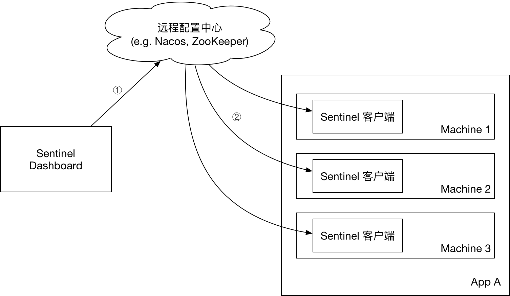
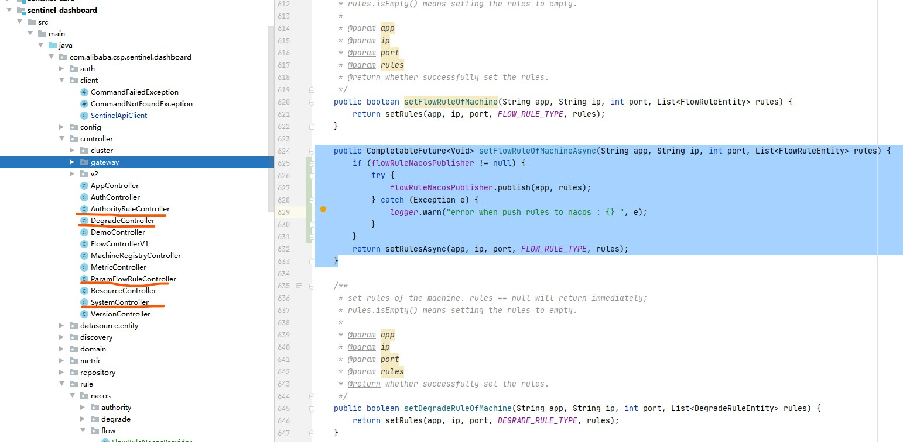

# [sentinel](https://github.com/alibaba/Sentinel/wiki/%E4%BB%8B%E7%BB%8D)

```shell script
docker run --name sentinel -d \ 
-p 8858:8858 \ 
bladex/sentinel-dashboard
```

访问 `http://local:8858/#/dashboard` 


对比 Hystrix 缺陷:
1. 需要自己搭建监控平台,运行启动
2. 没有web管理界面提供细粒度化的配置如:服务熔断,服务降级,服务限流

可以看到 Hystrix 的关注点在于以隔离和熔断为主的容错机制，超时或被熔断的调用将会快速失败，并可以提供 fallback 机制。

而 Sentinel 的侧重点在于：
- 多样化的流量控制
- 熔断降级
- 系统负载保护
- 实时监控和控制台

# Sentinel 特性


# 1. 编码


使用spring-cloud-demo-provider-payment 加入sentinel 作为服务提供方

## 1.1  引入pom

- spring-cloud-demo-provider-payment  

```xml
<!-- 后续做持久化用到 -->
<dependency>
<groupId>com.alibaba.csp</groupId>
<artifactId>sentinel-datasource-nacos</artifactId>
</dependency>
<dependency>
<groupId>com.alibaba.cloud</groupId>
<artifactId>spring-cloud-starter-alibaba-sentinel</artifactId>
</dependency>
```

## 1.2 修改配置文件

直接新增配置文件

- application-sentinel.yml

```yaml

spring:
  application:
    name: sentinel-provider-payment-service
  cloud:
    nacos:
      discovery:
        server-addr: local:8848
    sentinel:
      transport:
        # 刚才的sentinel 控制台地址
        dashboard: local:8858
        # 默认端口  假如被占用从8719开始+1扫描直到直到未被占用的端口
        port: 8719
management:
  endpoints:
    web:
      exposure:
        include: '*'
server:
  port: 8401

```

## 1.3 选择这个配置文件启动

- 启动之前应该先将nacos+sentinel 都启动


## 1.4 测试，调用之前的接口

在sentinel 控制台中看到对应的请求


## 1.5 流控规则介绍

资源名：唯一名称，默认请求路径

针对来源：Sentinel可以针对调用者进行限流 ，填写微服务名，默认 default ， 也可以从簇点路径中直接针对请求添加

阈值类型：
- QPS（每秒请求数量）：当调用api的QPS达到阈值后进行限流
- 线程数：调用该api的线程数达到阈值后进行限流

是否集群：
- 否
- 集群：1.分摊 2.总值 

流控模式：

直接：api达到限流条件时直接限流

关联：当关联的资源达到阈值时就限流自己

链路：只记录指定链路上的流量（指定资源从入口资源进来的流量，如果达到阈值就进行限流）

流控效果 ： 

- 快速失败：直接失败，抛异常

- Warm Up：根据codeFactor（冷加热因子，默认3）的值，从阈值 codeFactor，经过预热时长，才达到设定的QPS阈值。

- 排队等待 ： 多出来的就排队慢慢处理

> 可以在swagger 接口文档中点击对其测试，或者使用jmeter，postman等工具

## 1.6 熔断降级
熔断降级会在调用链路中某个资源出现不稳定状态时（例如调用超时或异常比例升高），对这个资源的调用进行限制，
让请求快速失败，避免影响到其它的资源而导致级联错误。 **没有半开状态**


1. 平均响应时间 (DEGRADE_GRADE_RT)：当 1s 内持续进入 N 个请求，对应时刻的平均响应时间（秒级）均超过阈值（count，以 ms 为单位），那么在接下的时间窗口（DegradeRule 中的 timeWindow，以 s 为单位）之内，对这个方法的调用都会自动地熔断（抛出 DegradeException）。注意 Sentinel 默认统计的 RT 上限是 4900 ms，超出此阈值的都会算作 4900 ms，若需要变更此上限可以通过启动配置项 -Dcsp.sentinel.statistic.max.rt=xxx 来配置。

2. 异常比例 (DEGRADE_GRADE_EXCEPTION_RATIO)：当资源的每秒请求量 >= N（可配置），并且每秒异常总数占通过量的比值超过阈值（DegradeRule 中的 count）之后，资源进入降级状态，即在接下的时间窗口（DegradeRule 中的 timeWindow，以 s 为单位）之内，对这个方法的调用都会自动地返回。异常比率的阈值范围是 [0.0, 1.0]，代表 0% - 100%。

3. 异常数 (DEGRADE_GRADE_EXCEPTION_COUNT)：当资源近 1 分钟的异常数目超过阈值之后会进行熔断。注意由于统计时间窗口是分钟级别的，若 timeWindow 小于 60s，则结束熔断状态后仍可能再进入熔断状态。


## 1.7  热点参数限流
针对经常访问的数据进行限流，比如：商品id为参数，某一热点商品需要限制一段时间内频繁访问

> 加个测试类：top.freshgeek.springcloud.payment.controller.SentinelTestController

> 注意：这里一定要加注解，并且只会处理blockException 不处理其他异常


### 1.7.1 特殊情况例外

可以配置特殊项设定其他限流阈值,类型为基本类型＋string


## 1.8  系统自适应限流


系统自适应限流是为了保证系统不被拖垮，使系统在稳定的前提下，保持系统吞吐量

### 1.8.1 系统保护的问题

长期以来系统保护是根据负载来做系统过载保护。当负载超过某个阈值，就禁止或减少流量进入，负载好转后恢复流量进入。

如果根据当前负载的情况调节流量通过率，始终有延迟。这样会浪费系统处理能力。所以看到的曲线总会有所抖动。

恢复慢，下游应用不可靠导致应用 RT 很好，从而负载很高，但过了一段时间下游恢复了，其实应该大幅增加流量通过率。但这时候load仍然很高。通过率恢复仍然不高。 ==最终目的：在系统不被拖垮的情况下，提高系统的吞吐率，而不是 load 一定要到低于某个阈值==


### 1.8.2 能做什么
从单台机器的 load、CPU 使用率、平均 RT、入口 QPS 和并发线程数等几个维度监控应用指标，让系统尽可能跑在最大吞吐量的同时保证系统整体的稳定性。

- Load 自适应（仅对 Linux/Unix-like 机器生效）：系统的 load1 作为启发指标，进行自适应系统保护。当系统 load1 超过设定的启发值，且系统当前的并发线程数超过估算的系统容量时才会触发系统保护（BBR 阶段）。系统容量由系统的 maxQps * minRt 估算得出。设定参考值一般是 CPU cores * 2.5。

- CPU usage（1.5.0+ 版本）：当系统 CPU 使用率超过阈值即触发系统保护（取值范围 0.0-1.0），比较灵敏。

- 平均 RT：当单台机器上所有入口流量的平均 RT 达到阈值即触发系统保护，单位是毫秒。

- 并发线程数：当单台机器上所有入口流量的并发线程数达到阈值即触发系统保护。

- 入口 QPS：当单台机器上所有入口流量的 QPS 达到阈值即触发系统保护。


## 1.9 配置兜底两种方法

- 上面的自定义方法     @SentinelResource(value = "A",blockHandler = "exceptionA")

- 自定义异常处理类     @SentinelResource(value = "B",blockHandlerClass = ExceptionHandler.class,blockHandler = "handler1")

这些都是在hystrix用过类似的就不详细讲了

# 结合 spring-cloud-demo-consumer-order 替代hystrix

## 1.引入pom
```xml

        <!--alibaba-sentinel 作为熔断降级-->
        <!-- 后续做持久化用到 -->
        <dependency>
            <groupId>com.alibaba.csp</groupId>
            <artifactId>sentinel-datasource-nacos</artifactId>
        </dependency>
        <dependency>
            <groupId>com.alibaba.cloud</groupId>
            <artifactId>spring-cloud-starter-alibaba-sentinel</artifactId>
        </dependency>
```

同时把hystrix 代码注释掉


## 2. 修改配置文件

打开feign 的sentinel 支持

```yaml

feign:
  sentinel:
    enabled: true
```

## 3. 运行提供方和调用方

执行 spring-cloud-demo-consumer-order 中的 'http://localhost/feign/payment/pay-timeout'

这时出现aop的全局兜底，说明整合成功，能够走到统一的兜底


# 规则持久化

目前 sentinel 是通过控制面板去配置规则，但是如果微服务重启就会把所有的规则都重置，所以我们需要把这些规则持久化，避免出现这种情况

同时sentinel 目前版本支持 配置中心控制台/Sentinel 控制台 → 配置中心 → Sentinel 数据源 → Sentinel，而不是经 Sentinel 数据源推送至配置中心。




但是这种情况并没有完成在sentinel dashboard 中配置后推送到nacos ， 只实现了从nacos中读 ，因此需要手动在nacos等配置中心手动配置。

我们先把读的功能解决（在nacos中配置后，能够读取到规则并生效），同时网上已经有通过修改源码方式启动sentinel 可以完成写的功能，放在第二个讲解

## 1.通过 nacos 读取规则配置

### 1.1 加入pom
客户端读取配置信息只需要在接入sentinel 的客户端加入pom
```xml
      <dependency>
            <groupId>com.alibaba.csp</groupId>
            <artifactId>sentinel-datasource-nacos</artifactId>
        </dependency>
```

### 1.2 修改配置文件

```yaml
spring:
  cloud:
    sentinel:
      datasource:
        # 名称随意，这里按不同规则区分
        flow:
          nacos:
            server-addr: local:8848
            dataId: ${spring.application.name}-flow-rules
            groupId: SENTINEL_GROUP
            data-type: json #数据格式
            # 规则类型，取值见：
            # org.springframework.cloud.alibaba.sentinel.datasource.RuleType
            rule-type: flow
        degrade:
          nacos:
            server-addr: local:8848
            dataId: ${spring.application.name}-degrade-rules
            groupId: SENTINEL_GROUP
            data-type: json #数据格式
            rule-type: degrade
        system:
          nacos:
            server-addr: local:8848
            dataId: ${spring.application.name}-system-rules
            groupId: SENTINEL_GROUP
            data-type: json #数据格式
            rule-type: system
        authority:
          nacos:
            server-addr: local:8848
            dataId: ${spring.application.name}-authority-rules
            groupId: SENTINEL_GROUP
            data-type: json #数据格式
            rule-type: authority
        param-flow:
          nacos:
            server-addr: local:8848
            dataId: ${spring.application.name}-param-flow-rules
            groupId: SENTINEL_GROUP
            data-type: json #数据格式
            rule-type: param-flow
```

### 1.3 在nacos 中手动添加规则
cloud-payment-service-flow-rules
SENTINEL_GROUP
```json
[
    {
        "resource":"/A", 
        "limitApp":"default", 
        "grade":1,
        "count":1, 
        "strategy":0, 
        "controlBehavior":0, 
        "clusterMode":false  
    }
]
```


其中sentinel 生效：


对应关系如下：
```text
[
    {
        "resource":"/A",//资源名称
        "limitApp":"default",//来源应用
        "grade":1,//阈值类型，0线程数，1QPS
        "count":1,//单机阈值
        "strategy":0,//流控模式，0表示直接，1表示关联，2表示链路
        "controlBehavior":0,//流控效果 ，0表示快速失败，1表示warm up，2表示排队等待
        "clusterMode":false //是否集群
    }
]
```

## 2. 修改源码启动sentinel 完成自动推入 nacos
> 这里我也很纳闷，看issue 在1.3开始就有这个需求了，到现在1.8还没有提供解决方案，也不知道为啥，希望后面官方能出一个解决，大家就不用修改源码了
从官方fork 一份代码，或者直接clone 一份代码

- https://github.com/alibaba/Sentinel
- https://gitee.com/mirrors/Sentinel

或者直接用我的（基于1.8） https://gitee.com/pocg/Sentinel/tree/release-1.8/ 

### 思路

原理（基于1.8）：
1. 根据控制台我们点击做增删改查的时候的请求找到后端对应的controller 
2. 修改对应controller 中保存和查询的 到 nacos （也可以到Apollo，zookeeper等）


# 开始修改

## 1. 克隆或者fork 源码打开
找到 sentinel-dashboard 模块

## 2. 将 pom.xml 注释test


## 3. 复制代码 
把 test 中的 `com.alibaba.csp.sentinel.dashboard.rule.nacos` 复制到 `com.alibaba.csp.sentinel.dashboard.rule`


当然只有四个,其他都是后面写的：
- FlowRuleNacosProvider 从nacos 获取`降级规则` 到 dashboard
- FlowRuleNacosPublisher 把 dashboard `降级规则` 推到 nacos
- NacosConfig  nacons 所需的bean 包括一个nacos 配置信息 ， 一个`降级规则` 序列化 ， 一个 `降级规则` 反序列化
- NacosConfigUtil nacos 的一些常量

## 4. 修改代码-连接nacos

sentinel 连 nacos 我们一般都是放在系统变量中方便后面部署时指定

- NacosConfig.java

```java
	@Bean
	public ConfigService nacosConfigService() throws Exception {
		Properties properties = System.getProperties();
		properties.put(PropertyKeyConst.SERVER_ADDR, DashboardConfig.getConfigNacosServer());
		if (StringUtil.isNotEmpty(DashboardConfig.getConfigNacosNamespace())){
			properties.put(PropertyKeyConst.NAMESPACE, DashboardConfig.getConfigNacosNamespace());
		}
		return ConfigFactory.createConfigService(properties);
	}
```
同时加两个常量
- DashboardConfig

```java

public class DashboardConfig {

    public static final int DEFAULT_MACHINE_HEALTHY_TIMEOUT_MS = 60_000;

    /**
     * CONFIG_NACOS_SERVER
     */
    public static final String CONFIG_NACOS_SERVER = "sentinel.dashboard.nacos.server";

    /**
     * CONFIG_NACOS_NAMESPACE
     */
    public static final String CONFIG_NACOS_NAMESPACE = "sentinel.dashboard.nacos.namespace";
 
}
```

## 5.修改降级 推送-获取

根据api可以知道url ， 找到controller  `FlowControllerV1` 

> 不知道这里为啥多了个V1 , 其实从名字也可以知道是哪个负责哪个


其实看了后面一些接口，我们就能知道我们其实都是根据 `com.alibaba.csp.sentinel.dashboard.client.SentinelApiClient` 
这个类 使用 `httpClient` 去 增删改查 
同时又有一个 repository , 内存中也有一个份 ， 我们这里对 SentinelApiClient 改造比较方便，所以都直接在SentinelApiClient 中修改，避免改动controller方法


1.添加依赖注入

- SentinelApiClient
```java

    @Autowired(required = false)
    private DynamicRuleProvider<List<FlowRuleEntity>> flowRuleNacosProvider;
    @Autowired(required = false)
    private DynamicRulePublisher<List<FlowRuleEntity>> flowRuleNacosPublisher;

```

2.查询的地方

- com.alibaba.csp.sentinel.dashboard.client.SentinelApiClient#fetchFlowRuleOfMachine

```java

    public List<FlowRuleEntity> fetchFlowRuleOfMachine(String app, String ip, int port) {
        //  如果不为空就直接从nacos 中查
        if (flowRuleNacosProvider != null) {
            try {
                return flowRuleNacosProvider.getRules(app);
            } catch (Exception e) {
                logger.warn("error when get rules from nacos : {} ", e);
            }
        }
        List<FlowRule> rules = fetchRules(ip, port, FLOW_RULE_TYPE, FlowRule.class);
        if (rules != null) {
            return rules.stream().map(rule -> FlowRuleEntity.fromFlowRule(app, ip, port, rule))
                .collect(Collectors.toList());
        } else {
            return null;
        }
    }

```

3.修改删除

- com.alibaba.csp.sentinel.dashboard.controller.FlowControllerV1#publishRules
```java
    private CompletableFuture<Void> publishRules(String app, String ip, Integer port) {
        List<FlowRuleEntity> rules = repository.findAllByMachine(MachineInfo.of(app, ip, port));
        return sentinelApiClient.setFlowRuleOfMachineAsync(app, ip, port, rules);
    }
```
可以看到修改删除 都是在操作之后调用这个方法，这个方法就是先从前面说的内存中查出全部的来，调用sentinelApiClient 设置一下


所以我们在前面调用flowRuleNacosPublisher 推送到nacos ， 这样思路就很清楚了，改两处就行

- com.alibaba.csp.sentinel.dashboard.client.SentinelApiClient#setFlowRuleOfMachineAsync
```java
    public CompletableFuture<Void> setFlowRuleOfMachineAsync(String app, String ip, int port, List<FlowRuleEntity> rules) {
        if (flowRuleNacosPublisher != null) {
            try {
                flowRuleNacosPublisher.publish(app, rules);
            } catch (Exception e) {
                logger.warn("error when push rules to nacos : {} ", e);
            }
        }
        return setRulesAsync(app, ip, port, FLOW_RULE_TYPE, rules);
    }
```

4.其他几个也是一样的加


1. NacosConfig 中添加对应规则的序列化-反序列化器
2. 把flowRuleNacosProvider  flowRuleNacosPublisher 复制一份 修改其中的 RuleEntity 和 `NacosConfigUtil. DATA_ID_POSTFIX`
3. 找到上图中的controller ，调用SentinelApiClient的方法中提前从Provider读取，和Publisher注入
> 这里就和前面上一节 手动配置的类型对应上了，有几种规则就有几个 Provider+Publisher

5.全部完成后就可以启动测试了
可以看到根据名在dashboard中操作，能够自动输出到nacos


