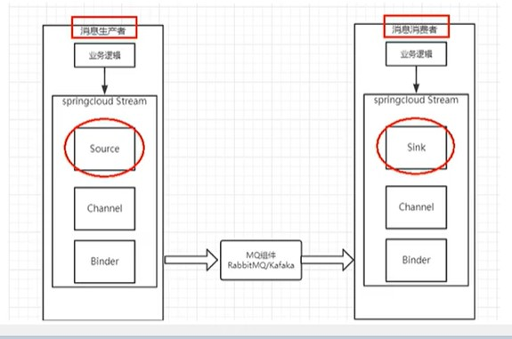

# [Spring Cloud Stream 构建消息驱动微服务的框架](https://spring.io/projects/spring-cloud-stream#overview)
> 官方文档 [https://docs.spring.io/spring-cloud-stream/docs/3.0.10.RELEASE/reference/html/spring-cloud-stream.html#spring-cloud-stream-reference](https://docs.spring.io/spring-cloud-stream/docs/3.0.10.RELEASE/reference/html/spring-cloud-stream.html#spring-cloud-stream-reference)
>


应用程序通过 inputs 或者 outputs 来与 Spring Cloud Stream 中binder 交互，
通过我们配置来 binding ，而 Spring Cloud Stream 的 binder 负责与消息中间件交互。

所以，我们只需要搞清楚如何与 Spring Cloud Stream 交互就可以方便使用消息驱动的方式。

通过使用Spring Integration来连接消息代理中间件以实现消息事件驱动。

Spring Cloud Stream 为一些供应商的消息中间件产品提供了个性化的自动化配置实现，引用了发布-订阅、消费组、分区的三个核心概念。

目前`仅支持RabbitMQ、Kafka`。

## 1. 为啥使用这个 

1、异步处理

比如用户在电商网站下单，下单完成后会给用户推送短信或邮件，发短信和邮件的过程就可以异步完成。因为下单付款是核心业务，发邮件和短信并不属于核心功能，并且可能耗时较长，所以针对这种业务场景可以选择先放到消息队列中，有其他服务来异步处理。

2、应用解耦：

假设公司有几个不同的系统，各系统在某些业务有联动关系，比如 A 系统完成了某些操作，需要触发 B 系统及 C 系统。如果 A 系统完成操作，主动调用 B 系统的接口或 C 系统的接口，可以完成功能，但是各个系统之间就产生了耦合。用消息中间件就可以完成解耦，当 A 系统完成操作将数据放进消息队列，B 和 C 系统去订阅消息就可以了。这样各系统只要约定好消息的格式就好了。

3、流量削峰

比如秒杀活动，一下子进来好多请求，有的服务可能承受不住瞬时高并发而崩溃，所以针对这种瞬时高并发的场景，在中间加一层消息队列，把请求先入队列，然后再把队列中的请求平滑的推送给服务，或者让服务去队列拉取。

4、日志处理

kafka 最开始就是专门为了处理日志产生的。

当碰到上面的几种情况的时候，就要考虑用消息队列了。
如果你碰巧使用的是 RabbitMQ 或者 kafka，而且同样也是在使用 Spring Cloud ，那可以考虑下用 Spring Cloud Stream。


Spring Cloud Stream 相当于屏蔽了具体中间件的操作可以有效简化开发人员对消息中间件的使用复杂度，让系统开发人员可以有更多的精力关注于核心业务逻辑的处理

同时为一些供应商的消息中间件产品提供了个性化的自动化配置实现，并引入了发布-订阅、消费组、分区这三个核心概念。
 

## 2. 如何使用




这边还是使用前面config+bus消息总线中使用的rabbitmq,附一下docker 搭建语句

```shell script
# 拉取镜像
docker pull rabbitmq:3.7.14-rc.1-management-alpine
# 运行镜像
docker run -d --name rbmq3.7.14 -p 15672:15672 -p 5672:5672  docker.io/rabbitmq:3.7.14-rc.1-management-alpine
```

然后可以通过IP:15672 端口 访问管理界面 , 默认用户名/密码为:`guest`

同时，这里创建两个工程：
- spring-cloud-demo-stream-rabbitmq-provider 生产者
- spring-cloud-demo-stream-rabbitmq-consumer 消费者


### 2.1 生产者引入pom

- spring-cloud-demo-stream-rabbitmq-provider

```xml
  <dependency>
            <groupId>org.springframework.boot</groupId>
            <artifactId>spring-boot-starter-web</artifactId>
        </dependency>
        <dependency>
            <groupId>org.springframework.boot</groupId>
            <artifactId>spring-boot-starter-actuator</artifactId>
        </dependency>
        <dependency>
            <groupId>org.springframework.cloud</groupId>
            <artifactId>spring-cloud-starter-netflix-eureka-client</artifactId>
        </dependency>
        <dependency>
            <groupId>org.springframework.cloud</groupId>
            <artifactId>spring-cloud-starter-stream-rabbit</artifactId>
        </dependency>
        <!--基础配置-->
        <dependency>
            <groupId>org.springframework.boot</groupId>
            <artifactId>spring-boot-devtools</artifactId>
            <scope>runtime</scope>
            <optional>true</optional>
        </dependency>
        <dependency>
            <groupId>org.projectlombok</groupId>
            <artifactId>lombok</artifactId>
            <optional>true</optional>
        </dependency>
        <dependency>
            <groupId>org.springframework.boot</groupId>
            <artifactId>spring-boot-starter-test</artifactId>
            <scope>test</scope>
        </dependency>
```

### 2.2 yml


```yaml

server:
  port: 8801

spring:
  application:
    name: cloud-stream-provider
  cloud:
    stream:
      binders: # 在此处配置要绑定的rabbitmq的服务信息；
        defaultRabbit: # 表示定义的名称，用于于binding整合
          type: rabbit # 消息组件类型
          environment: # 设置rabbitmq的相关的环境配置
            spring:
              rabbitmq:
                host: local
                port: 5672
                username: guest
                password: guest
      bindings: # 服务的整合处理
        output: # 这个名字是一个通道的名称
          destination: studyExchange # 表示要使用的Exchange名称定义
          content-type: application/json # 设置消息类型，本次为json，文本则设置“text/plain”
          binder: defaultRabbit # 设置要绑定的消息服务的具体设置

eureka:
  client: # 客户端进行Eureka注册的配置
    service-url:
      defaultZone: http://localhost:8761/eureka
  instance:
    lease-renewal-interval-in-seconds: 2 # 设置心跳的时间间隔（默认是30秒）
    lease-expiration-duration-in-seconds: 5 # 如果现在超过了5秒的间隔（默认是90秒）
    instance-id: send-8801.com  # 在信息列表时显示主机名称
    prefer-ip-address: true     # 访问的路径变为IP地址
```

### 2.3 加注解

微服务的基础注解

```java
package top.freshgeek.springcloud.stream.provider;

import org.springframework.boot.SpringApplication;
import org.springframework.boot.autoconfigure.SpringBootApplication;
import org.springframework.cloud.netflix.eureka.EnableEurekaClient;

/**
 * @author chen.chao
 */
@EnableEurekaClient
@SpringBootApplication
public class StreamRabbitmqProviderApplication {

	public static void main(String[] args) {
		SpringApplication.run(StreamRabbitmqProviderApplication.class, args);
	}
}


```

### 2.4 业务类

这里附一下常用api


- 消息接口


```java

package top.freshgeek.springcloud.stream.provider.service;

/**
 * @author chen.chao
 */
public interface MessageProvider {

	String send();

}

```

- 实现类

```java

package top.freshgeek.springcloud.stream.provider.service.impl;

import org.springframework.cloud.stream.annotation.EnableBinding;
import org.springframework.cloud.stream.messaging.Source;
import org.springframework.messaging.MessageChannel;
import org.springframework.messaging.support.MessageBuilder;
import top.freshgeek.springcloud.stream.provider.service.MessageProvider;

import javax.annotation.Resource;
import java.util.UUID;

/**
 * @author chen.chao
 */
@EnableBinding(Source.class)
public class MessageProviderImpl implements MessageProvider {

	@Resource
	private MessageChannel output;

	@Override
	public String send() {
		String s = UUID.randomUUID().toString();
		output.send(MessageBuilder.withPayload(s).build());
		System.out.println("发送:" + s);
		return s;
	}
}

```

- 最后加个controller 方便测试调用

```java

package top.freshgeek.springcloud.stream.provider.controller;

import org.springframework.web.bind.annotation.GetMapping;
import org.springframework.web.bind.annotation.RestController;
import top.freshgeek.springcloud.stream.provider.service.MessageProvider;

import javax.annotation.Resource;

/**
 * @author chen.chao
 */
@RestController
public class MessageController {

	@Resource
	private MessageProvider messageProvider;


	@GetMapping("/send")
	public String send() {
		return messageProvider.send();
	}

}

```

然后启动eureka后启动 `spring-cloud-demo-stream-rabbitmq-provider` , 访问 `http://localhost:8801/send`


## 消费者配置

- `spring-cloud-demo-stream-rabbitmq-consumer` 

### 1. 同样相同的加入pom

```xml
    <dependency>
            <groupId>org.springframework.boot</groupId>
            <artifactId>spring-boot-starter-web</artifactId>
        </dependency>
        <dependency>
            <groupId>org.springframework.cloud</groupId>
            <artifactId>spring-cloud-starter-netflix-eureka-client</artifactId>
        </dependency>
        <dependency>
            <groupId>org.springframework.cloud</groupId>
            <artifactId>spring-cloud-starter-stream-rabbit</artifactId>
        </dependency>
        <dependency>
            <groupId>org.springframework.boot</groupId>
            <artifactId>spring-boot-starter-actuator</artifactId>
        </dependency>
        <!--基础配置-->
        <dependency>
            <groupId>org.springframework.boot</groupId>
            <artifactId>spring-boot-devtools</artifactId>
            <scope>runtime</scope>
            <optional>true</optional>
        </dependency>
        <dependency>
            <groupId>org.projectlombok</groupId>
            <artifactId>lombok</artifactId>
            <optional>true</optional>
        </dependency>
        <dependency>
            <groupId>org.springframework.boot</groupId>
            <artifactId>spring-boot-starter-test</artifactId>
            <scope>test</scope>
        </dependency>


```


### 2. 写入yml

```yaml
server:
  port: 8802

spring:
  application:
    name: cloud-stream-consumer
  cloud:
    stream:
      binders: # 在此处配置要绑定的rabbitmq的服务信息；
        defaultRabbit: # 表示定义的名称，用于于binding整合
          type: rabbit # 消息组件类型
          environment: # 设置rabbitmq的相关的环境配置
            spring:
              rabbitmq:
                host: local
                port: 5672
                username: guest
                password: guest
      bindings: # 服务的整合处理
        input: # 这个名字是一个通道的名称
          destination: studyExchange # 表示要使用的Exchange名称定义
          content-type: application/json # 设置消息类型，本次为对象json，如果是文本则设置“text/plain”
          binder: defaultRabbit # 设置要绑定的消息服务的具体设置
          #group: liuscoding


eureka:
  client: # 客户端进行Eureka注册的配置
    service-url:
      defaultZone: http://localhost:8761/eureka
  instance:
    lease-renewal-interval-in-seconds: 2 # 设置心跳的时间间隔（默认是30秒）
    lease-expiration-duration-in-seconds: 5 # 如果现在超过了5秒的间隔（默认是90秒）
    instance-id: receive-8802.com  # 在信息列表时显示主机名称
    prefer-ip-address: true     # 访问的路径变为IP地址
```


### 3. 启动类


```java
package top.freshgeek.springcloud.stream.consumer;


import org.springframework.boot.SpringApplication;
import org.springframework.boot.autoconfigure.SpringBootApplication;
import org.springframework.cloud.netflix.eureka.EnableEurekaClient;

/**
 * @author chen.chao
 */
@EnableEurekaClient
@SpringBootApplication
public class StreamRabbitmqConsumerApplication {

	public static void main(String[] args) {
		SpringApplication.run(StreamRabbitmqConsumerApplication.class, args);
	}

}

```

### 4. 加上监听器,监听消费消息

同时这里加了个端口,可以测试多个端口启动消费情况

```java

package top.freshgeek.springcloud.stream.consumer.listerner;

import org.springframework.beans.factory.annotation.Value;
import org.springframework.cloud.stream.annotation.EnableBinding;
import org.springframework.cloud.stream.annotation.StreamListener;
import org.springframework.cloud.stream.messaging.Sink;
import org.springframework.messaging.Message;
import org.springframework.stereotype.Component;

/**
 * @author chen.chao
 */
@Component
@EnableBinding(Sink.class)
public class ReceiveMessageListener {

	@Value("${server.port}")
	private String severPort;

	@StreamListener(Sink.INPUT)
	public void input(Message<String> message) {
		System.out.println("port" + severPort + "，----------->接收到的消息：" + message.getPayload());
	}
}

```


## 其他消费问题总结

1. 重复消费问题

重复消费问题,是生产和面试都是重点问题,需要保证一条信息,如订单支付,保证只被消费一次
这里使用分组解决,而默认stream分组名是流水号是随机的,没在同一个组存在重复消费
可以在 消费者端 配置 `spring.cloud.stream.bindings.input.group` 为同一个组

2. 消息持久化问题

这个问题,其实分两个端,一个是消息中间件端的持久化 , 一个是应用层的持久化,,前者需要对不用的消息中间件进行配置,
我们这里讨论后者.

情景: 假如消费者挂了,而生产者生产了消息,此时消费者再上线,应该要补上这段时间的消息,进行消费

问题产生的原因同样是因为没分组,所以应用启动时会随机生成组名,而随机生成的组名没用订阅消息消费,所以不能消费

我们需要在消息消费者端配置组,在消费者挂了之后,重新启动因为已经订阅了生产者,就会自动消费


