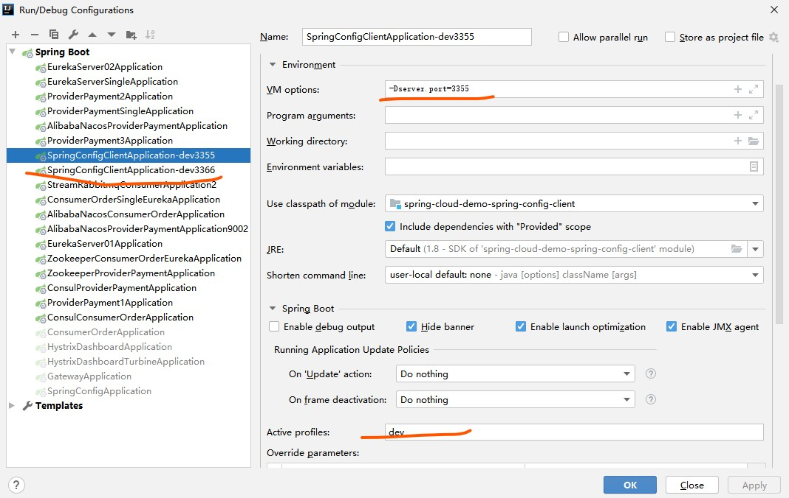

# Spring Config 
Spring Cloud Config 是 Spring Cloud 家族中最早的配置中心，虽然后来又发布了 Consul 可以代替配置中心功能，但是 Config 依然适用于 Spring Cloud 项目，通过简单的配置即可实现功能。
Spring Cloud Config 以 github 作为配置存储。
除了 git 外，还可以用数据库、svn、本地文件等作为存储。

Spring Cloud Config 主要解决了微服务中的各项配置的解耦合和统一化,还可以依赖第三方完成不同环境不同权限的功能:如开发环境与测试环境与生产环境由不同配置文件配置,同时不同配置文件的配置权限根据git或者文件划分权限等

我们这里使用演示Spring Config使用Git方式作为存储,并且完成自动刷新通知,后面再结合Bus 消息总线完成全部自动刷新通知

# 开始编码演示配置中心

创建新工程`spring-cloud-demo-spring-config`,将代理所有的配置文件,客户端需要配置文件则从配置中心中获取

> 其实这里的思想还是和 eureka等老派框架思想相似,想用什么功能就先搭建个什么服务工程,然后引入依赖作为服务端

## 1. 引入pom

```xml

  <dependency>
            <groupId>org.springframework.cloud</groupId>
            <artifactId>spring-cloud-config-server</artifactId>
        </dependency>
        <dependency>
            <groupId>org.springframework.boot</groupId>
            <artifactId>spring-boot-starter-actuator</artifactId>
        </dependency>
        <dependency>
            <groupId>org.springframework.boot</groupId>
            <artifactId>spring-boot-devtools</artifactId>
            <scope>runtime</scope>
            <optional>true</optional>
        </dependency>
        <dependency>
            <groupId>org.projectlombok</groupId>
            <artifactId>lombok</artifactId>
            <optional>true</optional>
        </dependency>
        <dependency>
            <groupId>org.springframework.boot</groupId>
            <artifactId>spring-boot-starter-test</artifactId>
            <scope>test</scope>
        </dependency>
```
 
## 2. 写yml

这里就是以本项目git作为地址,然后搜索 `spring-cloud-config-repo` 下的配置文件
```yaml
server:
  port: 3344

spring:
  application:
    name:  cloud-config-center #注册进Eureka服务器的微服务名
  cloud:
    config:
      server:
        git:
          uri: https://gitee.com/pocg/spring-cloud-demo.git #git仓库地址
          search-paths:
            - spring-cloud-config-repo
      ####读取分支
      label: master
```

## 3. 启动类

启动类加上`@EnableConfigServer`注解即可启动
 
 
## 4. 测试

1. 在git路径中加上配置文件,演示不同环境下的文件获取
- config-dev.yml
-  config-test.yml
-  config-prod.yml

2. 通过直接访问配置中心的路径方式获取git上配置文件信息,如:
`http://localhost:3344/master/config-dev.yml`

规则如下:
```java

/{application}/{profile}[/{label}]
/{application}-{profile}.yml
/{label}/{application}-{profile}.yml
/{application}-{profile}.properties
/{label}/{application}-{profile}.properties

```

如果可以访问,我们引入客户端

# 客户端编码读取配置中心

创建工程 `spring-cloud-demo-spring-config-client` 作为客户端,端口3355,去连接配置中心读取服务端配置文件信息

## 1. 引入pom

```xml
        <dependency>
            <groupId>org.springframework.cloud</groupId>
            <artifactId>spring-cloud-starter-config</artifactId>
        </dependency>
        <dependency>
            <groupId>org.springframework.boot</groupId>
            <artifactId>spring-boot-starter-web</artifactId>
        </dependency>
        <dependency>
            <groupId>org.springframework.boot</groupId>
            <artifactId>spring-boot-starter-actuator</artifactId>
        </dependency>

        <dependency>
            <groupId>org.springframework.boot</groupId>
            <artifactId>spring-boot-devtools</artifactId>
            <scope>runtime</scope>
            <optional>true</optional>
        </dependency>
        <dependency>
            <groupId>org.projectlombok</groupId>
            <artifactId>lombok</artifactId>
            <optional>true</optional>
        </dependency>
        <dependency>
            <groupId>org.springframework.boot</groupId>
            <artifactId>spring-boot-starter-test</artifactId>
            <scope>test</scope>
        </dependency>
```

## 2. 修改配置文件 bootstrap.yml
这里使用的不再是application.yml , 因为我们程序运行的属性需要去远程的配置中心读取,所以在应用启动前需要获取到配置参数,因此,在引导配置文件`bootstrap.yml`中配置

> 具体区别,可以在我的博客中 中专门介绍 几个配置文件的区别与优先级关系

```yaml
server:
  port: 3355

spring:
  application:
    name: config-client
  cloud:
    #Config客户端配置
    config:
      #分支名称
      label: master
      #配置文件名称
      name: config
      #读取后缀名称   上述3个综合：master分支上config-dev.yml的配置文件被读取http://config-3344.com:3344/master/config-dev.yml
      profile: dev
      #配置中心地址k
      uri: http://localhost:3344

# 暴露监控端点
management:
  endpoints:
    web:
      exposure:
        include: "*"
```

## 3. 启动类
普通启动类即可
```java

package top.freshgeek.springcloud.spring.configclient;


import org.springframework.boot.SpringApplication;
import org.springframework.boot.autoconfigure.SpringBootApplication;
import org.springframework.cloud.netflix.eureka.EnableEurekaClient;

/**
 * @author chen.chao
 */
@SpringBootApplication
public class SpringConfigClientApplication {

	public static void main(String[] args) {
		SpringApplication.run(SpringConfigClientApplication.class, args);
	}

}

```

## 4. 业务类

这里使用在配置文件的key 读取value ,然后访问了打印出来

```java

package top.freshgeek.springcloud.spring.configclient.controller;

import org.springframework.beans.factory.annotation.Value;
import org.springframework.cloud.context.config.annotation.RefreshScope;
import org.springframework.web.bind.annotation.GetMapping;
import org.springframework.web.bind.annotation.RestController;

/**
 * @author chen.chao
 */
@RestController
public class ConfigController {
	@Value("${config.info}")
	private String configInfo;

	@GetMapping("/configInfo")
	public String getConfigInfo() {
		return configInfo;
	}
}

```

## 4. 测试
访问客户端 `http://localhost:3355/configInfo` 可以显示正确的配置信息

## 5. 问题
1. 现在需要临时修改配置文件怎么办?能及时刷新到配置中心嘛?能及时刷新到客户端吗?

 答: 如果临时修改配置文件,配置中心可以实时刷新,但是客户端不能及时刷新(这里可以在git上修改后,通过访问配置中心的请求地址,与客户端地址对比),需要使用@RefreshScope注解后,
 对客户端调用`curl -X POST "http://localhost:3355/actuator/refresh"` 才能刷新


> 有多少台就要调多少次,虽然可以用脚本做,但是这种方式太lb了,改进方式 引入bus 消息总线(或者后面的nacos )

# 引入消息总线bus的多客户端通知

这里使用的是rabbit mq 作为消息总线的消息中间件,同样使用docker 安装部署

```shell script
# 拉取镜像
docker pull rabbitmq:3.7.14-rc.1-management-alpine
# 运行镜像
docker run -d --name rbmq3.7.14 -p 15672:15672 -p 5672:5672  docker.io/rabbitmq:3.7.14-rc.1-management-alpine

``` 

然后可以通过IP:15672 端口 访问管理界面 , 默认用户名/密码为:`guest`


## 1. 引入pom
- spring-cloud-demo-spring-config
- spring-cloud-demo-spring-config-client

用了就需要引入,因此两个项目都加入

```xml
<!--        添加消息总线RabbitMQ支持-->
        <dependency>
            <groupId>org.springframework.cloud</groupId>
            <artifactId>spring-cloud-starter-bus-amqp</artifactId>
        </dependency>
```

## 2. 修改配置文件

- spring-cloud-demo-spring-config

加入地址端口和用户名密码,同时暴露一个可以刷新的uri

```yaml
#rabbitmq相关配置
  rabbitmq:
    host: local
    port: 5672
    username: guest
    password: guest
#rabbitmq相关配置,暴露bus刷新配置的端点
management:
  endpoints: #暴露bus刷新配置的端点
    web:
      exposure:
        include: 'bus-refresh'
```

- spring-cloud-demo-spring-config-client

```yaml

  #rabbitmq相关配置 15672是Web管理界面的端口；5672是MQ访问的端口
  rabbitmq:
    host: local
    port: 5672
    username: guest
    password: guest

# 暴露监控端点
management:
  endpoints:
    web:
      exposure:
        include: "*"
```

## 3. 客户端启动多个实例
在启动文件中修改:
`      profile: ${spring.profiles.active}`
,这样再复制两份启动配置:


两个客户端,同时读取一份文件
dev->3355
dev->3366

## 4. 同时启动多个客户端测试一次刷新处处生效
1. 启动配置中心和两个客户端
- http://localhost:3344/master/config-dev.yml
- http://localhost:3355/configInfo
- http://localhost:3366/configInfo

2. 修改config-dev.yml
3. 配置中心已经生效

> http://localhost:3344/master/config-dev.yml

4. 两个客户端没有生效
5. 使用通知使其生效
其中通知方式有两种:
- 全局通知 `curl -X POST "http://localhost:3344/actuator/bus-refresh"`
- 定点通知 `curl -X POST "http://localhost:3344/actuator/bus-refresh/config-client:3355"`


