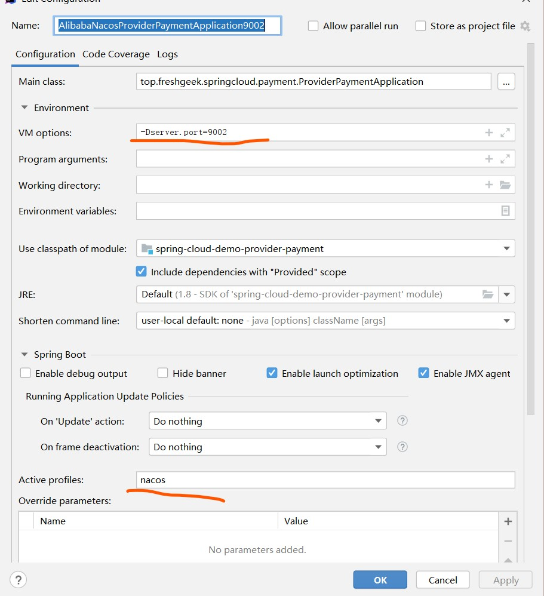
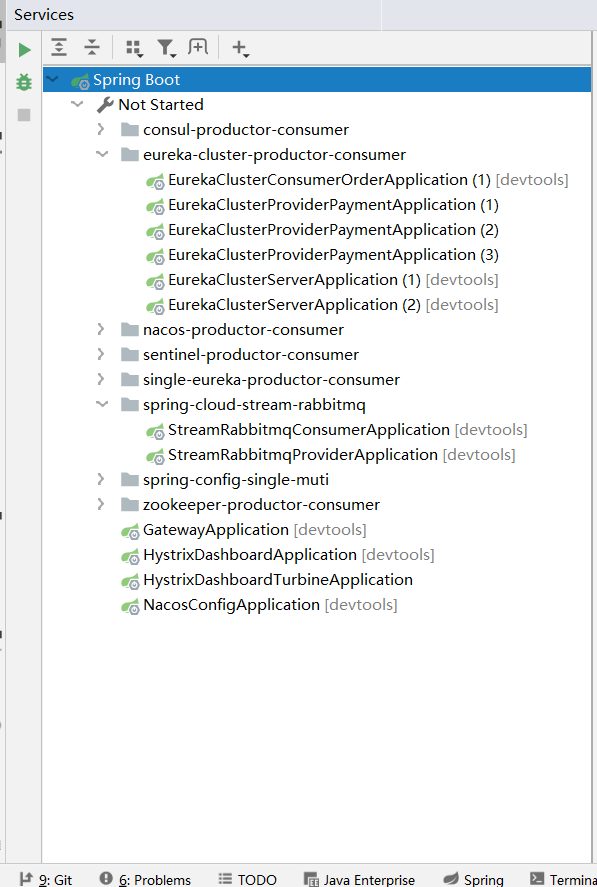
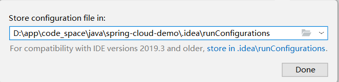

## 提示

为了兼容性,项目中统一使用域名,可以在本机hosts中配置对应的地址

127.0.0.1 eureka01

127.0.0.1 eureka02

- 这是目标安装各种服务的虚拟机的IP:

- 192.168.203.102 zookeeper

- 192.168.203.102 consul

- 192.168.203.102 nacos

- 192.168.203.102 sentinel

- 192.168.203.102 rabbitmq

- 192.168.203.102 zipkin

## 前提约定
本项目使用Idea,同时使用`-Dserver.port=` 添加虚拟机端口方式和指定配置环境`profile`方式替代复制多个模块方式演示不同环境/集群情况

配置启动方式如图(后面不一一介绍)：

## 提供启动文件

配置好依赖即可启动测试 , 但是还是建议对应讲解文档从前往后阅读测试 , 更方便理解原理

**注意**:需要ide 2019.3 later 版本才能出现

