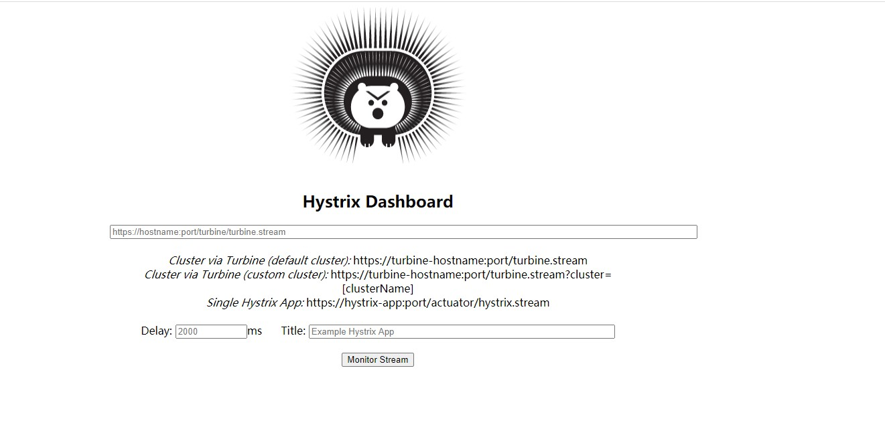
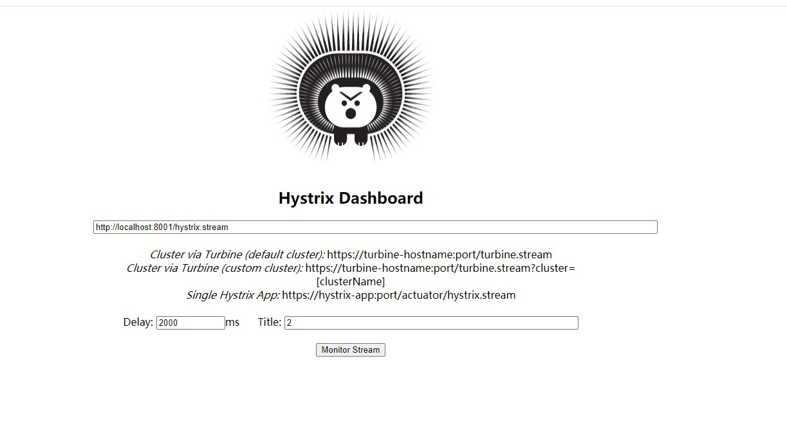

# Hystrix web 图标监控

首先引入依赖

```xml
    <dependency>
            <groupId>org.springframework.cloud</groupId>
            <artifactId>spring-cloud-starter-netflix-hystrix-dashboard</artifactId>
        </dependency>
        <dependency>
            <groupId>org.springframework.boot</groupId>
            <artifactId>spring-boot-starter-actuator</artifactId>
        </dependency>
        <dependency>
            <groupId>org.springframework.boot</groupId>
            <artifactId>spring-boot-devtools</artifactId>
            <scope>runtime</scope>
            <optional>true</optional>
        </dependency>
        <dependency>
            <groupId>org.projectlombok</groupId>
            <artifactId>lombok</artifactId>
            <optional>true</optional>
        </dependency>
        <dependency>
            <groupId>org.springframework.boot</groupId>
            <artifactId>spring-boot-starter-test</artifactId>
            <scope>test</scope>
        </dependency>

```


然后添加注解 
```java

package top.freshgeek.springcloud.hystrixdashboard;


import org.springframework.boot.SpringApplication;
import org.springframework.boot.autoconfigure.SpringBootApplication;
import org.springframework.cloud.netflix.hystrix.dashboard.EnableHystrixDashboard;

/**
 * @author chen.chao
 */
@SpringBootApplication
@EnableHystrixDashboard
public class HystrixDashboardApplication {
	public static void main(String[] args) {
		SpringApplication.run(HystrixDashboardApplication.class, args);
	}

}

```


然后在配置类中指定好端口 就可以启动了 

启动之后访问 IP 端口/hystrix  就可以看到图表


注意:

在这个版本中,如果需要监控需要在服务端加入代码,因为框架原因需要手动映射一下

```java


	/**
	 *此配置是为了服务监控而配置，与服务容错本身无关，springcloud升级后的坑
	 *ServletRegistrationBean因为springboot的默认路径不是"/hystrix.stream"，
	 *只要在自己的项目里配置上下面的servlet就可以了
	 */
	@Bean
	public ServletRegistrationBean getServlet() {
		HystrixMetricsStreamServlet streamServlet = new HystrixMetricsStreamServlet();
		ServletRegistrationBean registrationBean = new ServletRegistrationBean(streamServlet);
		registrationBean.setLoadOnStartup(1);
		registrationBean.addUrlMappings("/hystrix.stream");
		registrationBean.setName("HystrixMetricsStreamServlet");
		return registrationBean;
	}

```

然后启动 eureka 和 服务端 ,在路径中输入对应服务端的IP端口路径,如下:




这里好像只能监控一个输入一个,感觉交互和监控功能上都稍微有点欠缺

