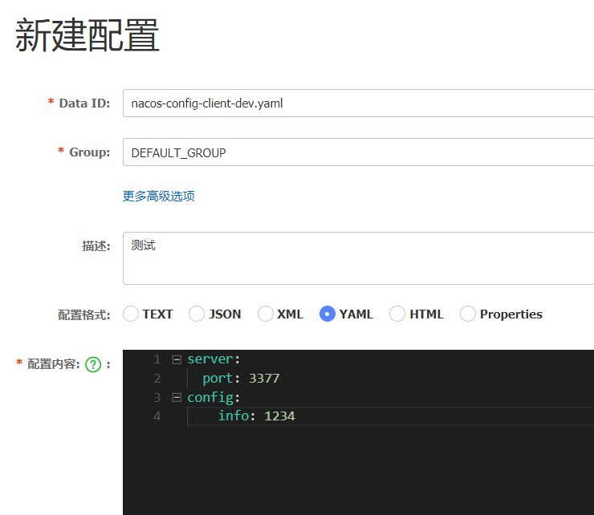
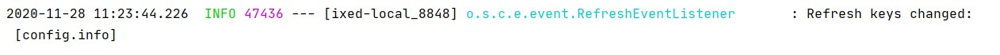

# Nacos Cofig

nacos config 可以提供统一的配置，首先需要下载安装启动nacos

## 使用配置

1. 引入pom

```xml
        <!--nacos-config-->
        <dependency>
            <groupId>com.alibaba.cloud</groupId>
            <artifactId>spring-cloud-starter-alibaba-nacos-config</artifactId>
        </dependency>
        <!--nacos-discovery-->
        <dependency>
            <groupId>com.alibaba.cloud</groupId>
            <artifactId>spring-cloud-starter-alibaba-nacos-discovery</artifactId>
        </dependency>
        <!--web + actuator-->
        <dependency>
            <groupId>org.springframework.boot</groupId>
            <artifactId>spring-boot-starter-web</artifactId>
        </dependency>
        <dependency>
            <groupId>org.springframework.boot</groupId>
            <artifactId>spring-boot-starter-actuator</artifactId>
        </dependency>
        <!--一般基础配置-->
        <dependency>
            <groupId>org.springframework.boot</groupId>
            <artifactId>spring-boot-devtools</artifactId>
            <scope>runtime</scope>
            <optional>true</optional>
        </dependency>
        <dependency>
            <groupId>org.projectlombok</groupId>
            <artifactId>lombok</artifactId>
            <optional>true</optional>
        </dependency>
        <dependency>
            <groupId>org.springframework.boot</groupId>
            <artifactId>spring-boot-starter-test</artifactId>
            <scope>test</scope>
        </dependency>


```

2. 写配置文件
一般开发场景都是把配置文件中心化，统一由配置中心配置，
应用读取后再启动，因此这里也是使用 `bootstrap.yml`


```yaml

# nacos配置
spring:
  profile:
    active: dev
  application:
    name: nacos-config-client
  cloud:
    nacos:
      discovery:
        server-addr: local:8848 #Nacos服务注册中心地址
      config:
        server-addr: local:8848 #Nacos作为配置中心地址
        file-extension: yaml #指定yaml格式的配置
# ${spring.application.name}-${spring.profile.active}.${spring.cloud.nacos.config.file-extension}
# nacos-config-client-dev.yaml


```


> 这里需要配置一下nacos
>


nacos-config-client-dev.yaml

```yaml
server:
    port:3377
config:
    info: 1234
```


加上启动类注解`@EnableDiscoveryClient`


然后一样写个key controller

```java

package top.freshgeek.springcloud.nacos.config.controller;

import org.springframework.beans.factory.annotation.Value;
import org.springframework.cloud.context.config.annotation.RefreshScope;
import org.springframework.web.bind.annotation.GetMapping;
import org.springframework.web.bind.annotation.RestController;

/**
 * @author chen.chao
 */
@RefreshScope
@RestController
public class ConfigController {
	@Value("${config.info}")
	private String configInfo;

	@GetMapping("/configInfo")
	public String getConfigInfo() {
		return configInfo;
	}
}

```

访问路径获取配置，然后修改nacos，发布


然后再次访问路径，可以看到已经刷新了,这样就完成了配置动态刷新

但是其实这里还有点不足，这边nacos 不能提供灰度发布，和权限控制没有Apollo 强

## nacos 配置 分空间，分组


## 接着两个问题

### 配置持久化

配置信息一般是比较多的，并且可能nacos出现故障启动之后不能让配置信息消失，因此需要加入持久化
官方推荐的是MySQL ，并且最少需要主从备份

### nacos 消除单点故障，集群部署

nacos 除了配置中心，还附带着服务发现功能，在微服务环境中，服务发现挂了，就全部完蛋，因此集群部署也是必须做的


