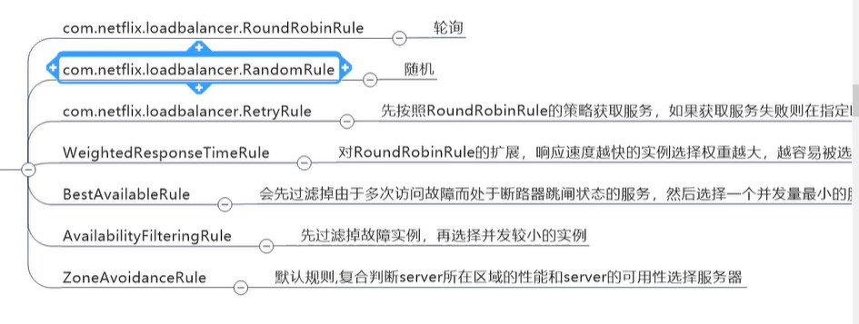

## zookeeper 代替eureka 作为注册中心


```xml

        <!--zookeeper 作为 注册中心-->
        <dependency>
            <groupId>org.springframework.cloud</groupId>
            <artifactId>spring-cloud-starter-zookeeper-discovery</artifactId>
        </dependency>

```

```yaml

server:
  port: 8004

spring:
  application:
    name: cloud-payment-service
  datasource:
    # 当前数据源操作类型
    type: com.alibaba.druid.pool.DruidDataSource
    # mysql驱动类
    driver-class-name: com.mysql.jdbc.Driver
    url: jdbc:mysql://192.168.35.3:3306/springcloud-payment?useUnicode=true&characterEncoding=UTF-8&useSSL=false&serverTimezone=GMT%2B8
    username: root
    password: root
  jpa:
    hibernate:
      ddl-auto: update
    show-sql: true
# 单个就配置单独一个即可
  cloud:
    zookeeper:
      connect-string: localhost:2181,localhost:2182,localhost:2183


```

** 服务端则一样 换下注解**

## 使用consul 替换 

首先,安装,采用docker

```shell

docker pull consul:1.6.1
docker run -d --net=host --name consul -e 'CONSUL_LOCAL_CONFIG={"skip_leave_on_interrupt": true}' consul:1.6.1 agent -server -bind=192.168.35.3 -bootstrap-expect=1 -ui -client=0.0.0.0

```

搭建好之后,可以访问ui 端口为8500


然后引用依赖 只保存一个
```xml

        <dependency>
            <groupId>org.springframework.cloud</groupId>
            <artifactId>spring-cloud-starter-consul-discovery</artifactId>
        </dependency>


```


然后在yml 文件中配置consul

```yaml

spring:
#### consul 注册中心  注解与zookeeper 一致
  cloud:
    consul:
      host: 192.168.35.3
      port: 8500
      discovery:
        service-name: ${spring.application.name}


```

最后,启动即可


# ribbon 负载均衡

恢复到eureka 集群状况

在eureka client 中自带了 ribbon jar 

自定义配置负载策略类,不能放在`Application` 下 及子包中
top.freshgeek.springcloud.rule.MyRuleConfig

包含方法:




例如:
```java

package top.freshgeek.springcloud.rule;

import com.netflix.loadbalancer.*;
import org.springframework.context.annotation.Bean;
import org.springframework.context.annotation.Configuration;

/**
 * @author chen.chao
 * @version 1.0
 * @date 2020/5/2 14:08
 * @description 不能放在容器扫描类下 及子包中
 */
@Configuration
public class MyRuleConfig {

    @Bean
    public IRule rule() {
        // 默认
        RoundRobinRule roundRobinRule = new RoundRobinRule();
        RandomRule randomRule = new RandomRule();
        RetryRule retryRule = new RetryRule();
        WeightedResponseTimeRule weightedResponseTimeRule = new WeightedResponseTimeRule();
        BestAvailableRule bestAvailableRule = new BestAvailableRule();
        AvailabilityFilteringRule availabilityFilteringRule = new AvailabilityFilteringRule();
        ZoneAvoidanceRule zoneAvoidanceRule = new ZoneAvoidanceRule();
        return new AvailabilityFilteringRule();
    }

}
```


## 带hystrix 熔断service

首先加入hystrix 依赖

```xml
        <!-- hystrix-->
        <dependency>
            <groupId>org.springframework.cloud</groupId>
            <artifactId>spring-cloud-starter-netflix-hystrix</artifactId>
        </dependency>

```

然后在业务中写代码,演示正常的 和  超时或者报错 兜底方法 

```java
	public CommonResult histrix_pay() {
		return CommonResult.of(200, "histrix_pay : " + serverPort);
	}

	@HystrixCommand(fallbackMethod = "fallbackMethod", commandProperties = {
			@HystrixProperty(name = "execution.isolation.thread.timeoutInMilliseconds", value = "1000")
	})
	public CommonResult histrix_pay_timeout() {
		try {
			TimeUnit.SECONDS.sleep(3);
		} catch (InterruptedException e) {
			e.printStackTrace();
		}
		return CommonResult.of(200, "histrix_pay : " + serverPort);
	}
	public CommonResult fallbackMethod() {
		return CommonResult.of(201, "fallbackMethod :" + serverPort);
	}
```

其中
> @HystrixCommand(fallbackMethod = "fallbackMethod", commandProperties = {
>			@HystrixProperty(name = "execution.isolation.thread.timeoutInMilliseconds", value = "1000")
>	})

表示 兜底方法  和 超时时间多少 


最后在启动类上面加上注解 `@EnableCircuitBreaker` 即完成

