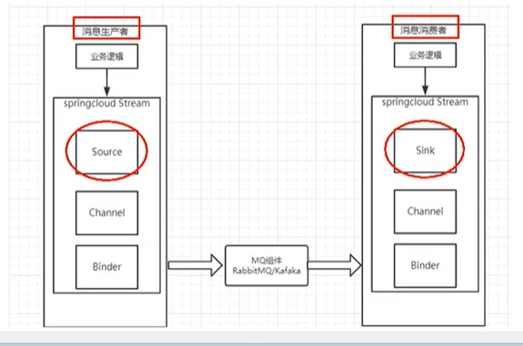
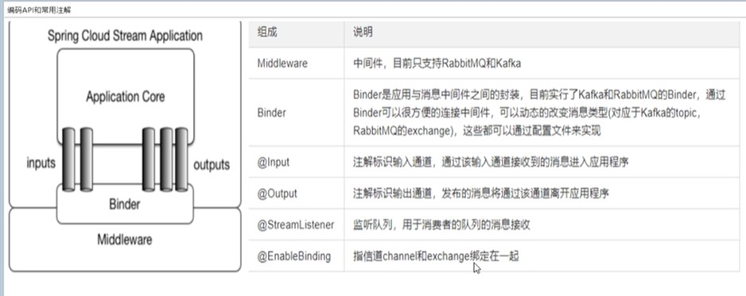

# [Spring Cloud Stream 构建消息驱动微服务的框架](https://spring.io/projects/spring-cloud-stream#overview)
> 官方文档 [https://docs.spring.io/spring-cloud-stream/docs/3.0.10.RELEASE/reference/html/spring-cloud-stream.html#spring-cloud-stream-reference](https://docs.spring.io/spring-cloud-stream/docs/3.0.10.RELEASE/reference/html/spring-cloud-stream.html#spring-cloud-stream-reference)
>


应用程序通过 inputs 或者 outputs 来与 Spring Cloud Stream 中binder 交互，
通过我们配置来 binding ，而 Spring Cloud Stream 的 binder 负责与消息中间件交互。

所以，我们只需要搞清楚如何与 Spring Cloud Stream 交互就可以方便使用消息驱动的方式。

通过使用Spring Integration来连接消息代理中间件以实现消息事件驱动。

Spring Cloud Stream 为一些供应商的消息中间件产品提供了个性化的自动化配置实现，引用了发布-订阅、消费组、分区的三个核心概念。

目前仅支持RabbitMQ、Kafka。

## 1. 为啥使用这个 


## 2. 如何使用




### 2.1 引入pom
```xml
  <dependency>
            <groupId>org.springframework.boot</groupId>
            <artifactId>spring-boot-starter-web</artifactId>
        </dependency>
        <dependency>
            <groupId>org.springframework.boot</groupId>
            <artifactId>spring-boot-starter-actuator</artifactId>
        </dependency>
        <dependency>
            <groupId>org.springframework.cloud</groupId>
            <artifactId>spring-cloud-starter-netflix-eureka-client</artifactId>
        </dependency>
        <dependency>
            <groupId>org.springframework.cloud</groupId>
            <artifactId>spring-cloud-starter-stream-rabbit</artifactId>
        </dependency>
        <!--基础配置-->
        <dependency>
            <groupId>org.springframework.boot</groupId>
            <artifactId>spring-boot-devtools</artifactId>
            <scope>runtime</scope>
            <optional>true</optional>
        </dependency>
        <dependency>
            <groupId>org.projectlombok</groupId>
            <artifactId>lombok</artifactId>
            <optional>true</optional>
        </dependency>
        <dependency>
            <groupId>org.springframework.boot</groupId>
            <artifactId>spring-boot-starter-test</artifactId>
            <scope>test</scope>
        </dependency>
```

### 2.2 yml

这边还是使用前面config 消息总线种使用的rabbitmq 

同样附一下docker 搭建语句
```shell script
# 拉取镜像
docker pull rabbitmq:3.7.14-rc.1-management-alpine
# 运行镜像
docker run -d --name rbmq3.7.14 -p 15672:15672 -p 5672:5672  docker.io/rabbitmq:3.7.14-rc.1-management-alpine
```
然后可以通过IP:15672 端口 访问管理界面 , 默认用户名/密码为:`guest`


```

```yaml

server:
  port: 8801

spring:
  application:
    name: cloud-stream-provider
  cloud:
    stream:
      binders: # 在此处配置要绑定的rabbitmq的服务信息；
        defaultRabbit: # 表示定义的名称，用于于binding整合
          type: rabbit # 消息组件类型
          environment: # 设置rabbitmq的相关的环境配置
            spring:
              rabbitmq:
                host: local
                port: 5672
                username: guest
                password: guest
      bindings: # 服务的整合处理
        output: # 这个名字是一个通道的名称
          destination: studyExchange # 表示要使用的Exchange名称定义
          content-type: application/json # 设置消息类型，本次为json，文本则设置“text/plain”
          binder: defaultRabbit # 设置要绑定的消息服务的具体设置

eureka:
  client: # 客户端进行Eureka注册的配置
    service-url:
      defaultZone: http://localhost:8761/eureka
  instance:
    lease-renewal-interval-in-seconds: 2 # 设置心跳的时间间隔（默认是30秒）
    lease-expiration-duration-in-seconds: 5 # 如果现在超过了5秒的间隔（默认是90秒）
    instance-id: send-8801.com  # 在信息列表时显示主机名称
    prefer-ip-address: true     # 访问的路径变为IP地址
```

### 2.3 加注解

微服务的基础注解
```java
package top.freshgeek.springcloud.stream.provider;


import org.springframework.boot.SpringApplication;
import org.springframework.boot.autoconfigure.SpringBootApplication;
import org.springframework.cloud.netflix.eureka.EnableEurekaClient;

/**
 * @author chen.chao
 */
@EnableEurekaClient
@SpringBootApplication
public class StreamRabbitmqProviderApplication {

	public static void main(String[] args) {
		SpringApplication.run(StreamRabbitmqProviderApplication.class, args);
	}

}

```

### 2.4 业务类

这里附一下常用api




消息接口
```java

package top.freshgeek.springcloud.stream.provider.service;

/**
 * @author chen.chao
 */
public interface MessageProvider {

	String send();

}

```

实现类

```java
package top.freshgeek.springcloud.stream.provider.service.impl;

import org.springframework.cloud.stream.annotation.EnableBinding;
import org.springframework.cloud.stream.messaging.Source;
import org.springframework.messaging.MessageChannel;
import org.springframework.messaging.support.MessageBuilder;
import top.freshgeek.springcloud.stream.provider.service.MessageProvider;

import javax.annotation.Resource;
import java.util.UUID;

/**
 * @author chen.chao
 */
@EnableBinding(Source.class)
public class MessageProviderImpl implements MessageProvider {

	@Resource
	private MessageChannel output;

	@Override
	public String send() {
		String s = UUID.randomUUID().toString();
		output.send(MessageBuilder.withPayload(s).build());
		System.out.println("发送:" + s);
		return s;
	}
}

```

最后加个controller 方便测试调用

```java

package top.freshgeek.springcloud.stream.provider.controller;

import org.springframework.web.bind.annotation.GetMapping;
import org.springframework.web.bind.annotation.RestController;
import top.freshgeek.springcloud.stream.provider.service.MessageProvider;

import javax.annotation.Resource;

/**
 * @author chen.chao
 */
@RestController
public class MessageController {

	@Resource
	private MessageProvider messageProvider;


	@GetMapping("/send")
	public String send() {
		return messageProvider.send();
	}

}

```


然后启动eureka后启动 `spring-cloud-demo-stream-rabbitmq-provider` 

访问 `http://localhost:8801/send`


## 生产者 消费者结合
创建新的模块 `spring-cloud-demo-stream-rabbitmq-consumer` 消费者

1. 同样相同的加入pom

```xml
    <dependency>
            <groupId>org.springframework.boot</groupId>
            <artifactId>spring-boot-starter-web</artifactId>
        </dependency>
        <dependency>
            <groupId>org.springframework.cloud</groupId>
            <artifactId>spring-cloud-starter-netflix-eureka-client</artifactId>
        </dependency>
        <dependency>
            <groupId>org.springframework.cloud</groupId>
            <artifactId>spring-cloud-starter-stream-rabbit</artifactId>
        </dependency>
        <dependency>
            <groupId>org.springframework.boot</groupId>
            <artifactId>spring-boot-starter-actuator</artifactId>
        </dependency>
        <!--基础配置-->
        <dependency>
            <groupId>org.springframework.boot</groupId>
            <artifactId>spring-boot-devtools</artifactId>
            <scope>runtime</scope>
            <optional>true</optional>
        </dependency>
        <dependency>
            <groupId>org.projectlombok</groupId>
            <artifactId>lombok</artifactId>
            <optional>true</optional>
        </dependency>
        <dependency>
            <groupId>org.springframework.boot</groupId>
            <artifactId>spring-boot-starter-test</artifactId>
            <scope>test</scope>
        </dependency>


```


2. 写入yml

```yaml
server:
  port: 8802

spring:
  application:
    name: cloud-stream-consumer
  cloud:
    stream:
      binders: # 在此处配置要绑定的rabbitmq的服务信息；
        defaultRabbit: # 表示定义的名称，用于于binding整合
          type: rabbit # 消息组件类型
          environment: # 设置rabbitmq的相关的环境配置
            spring:
              rabbitmq:
                host: local
                port: 5672
                username: guest
                password: guest
      bindings: # 服务的整合处理
        input: # 这个名字是一个通道的名称
          destination: studyExchange # 表示要使用的Exchange名称定义
          content-type: application/json # 设置消息类型，本次为对象json，如果是文本则设置“text/plain”
          binder: defaultRabbit # 设置要绑定的消息服务的具体设置
          #group: liuscoding


eureka:
  client: # 客户端进行Eureka注册的配置
    service-url:
      defaultZone: http://localhost:8761/eureka
  instance:
    lease-renewal-interval-in-seconds: 2 # 设置心跳的时间间隔（默认是30秒）
    lease-expiration-duration-in-seconds: 5 # 如果现在超过了5秒的间隔（默认是90秒）
    instance-id: receive-8802.com  # 在信息列表时显示主机名称
    prefer-ip-address: true     # 访问的路径变为IP地址
```


3. 启动类


```java
package top.freshgeek.springcloud.stream.consumer;


import org.springframework.boot.SpringApplication;
import org.springframework.boot.autoconfigure.SpringBootApplication;
import org.springframework.cloud.netflix.eureka.EnableEurekaClient;

/**
 * @author chen.chao
 */
@EnableEurekaClient
@SpringBootApplication
public class StreamRabbitmqConsumerApplication {

	public static void main(String[] args) {
		SpringApplication.run(StreamRabbitmqConsumerApplication.class, args);
	}

}

```

4. 加上监听器,监听消费消息

同时这里加了个端口,可以测试多个端口启动消费情况

```java

package top.freshgeek.springcloud.stream.consumer.listerner;

import org.springframework.beans.factory.annotation.Value;
import org.springframework.cloud.stream.annotation.EnableBinding;
import org.springframework.cloud.stream.annotation.StreamListener;
import org.springframework.cloud.stream.messaging.Sink;
import org.springframework.messaging.Message;
import org.springframework.stereotype.Component;

/**
 * @author chen.chao
 */
@Component
@EnableBinding(Sink.class)
public class ReceiveMessageListener {

	@Value("${server.port}")
	private String severPort;

	@StreamListener(Sink.INPUT)
	public void input(Message<String> message) {
		System.out.println("port" + severPort + "，----------->接收到的消息：" + message.getPayload());
	}
}

```


### 其他消费问题总结

1. 重复消费问题

重复消费问题,是生产和面试都是重点问题,需要保证一条信息,如订单支付,保证只被消费一次
这里使用分组解决,而默认stream分组名是流水号是随机的,没在同一个组存在重复消费
可以在 消费者端 配置 `spring.cloud.stream.bindings.input.group` 为同一个组

2. 消息持久化问题

这个问题,其实分两个端,一个是消息中间件端的持久化 , 一个是应用层的持久化,,前者需要对不用的消息中间件进行配置,
我们这里讨论后者.

情景: 假如消费者挂了,而生产者生产了消息,此时消费者再上线,应该要补上这段时间的消息,进行消费

问题产生的原因同样是因为没分组,所以应用启动时会随机生成组名,而随机生成的组名没用订阅消息消费,所以不能消费

我们需要在消息消费者端配置组,在消费者挂了之后,重新启动因为已经订阅了生产者,就会自动消费


